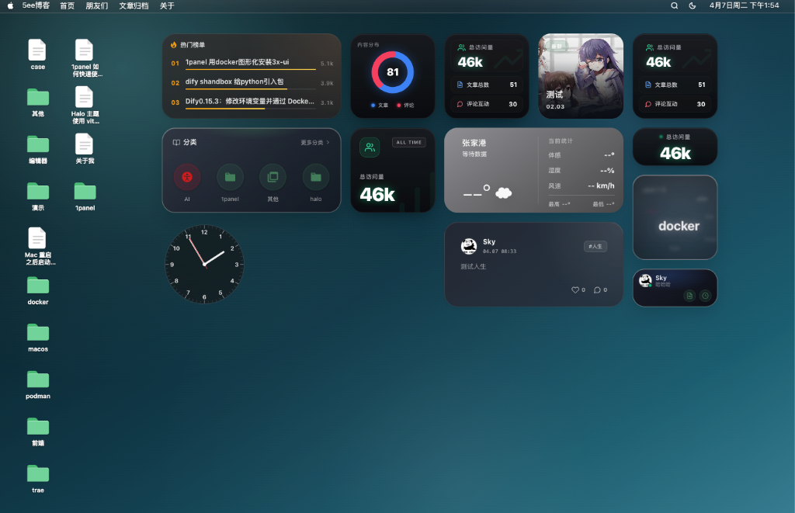
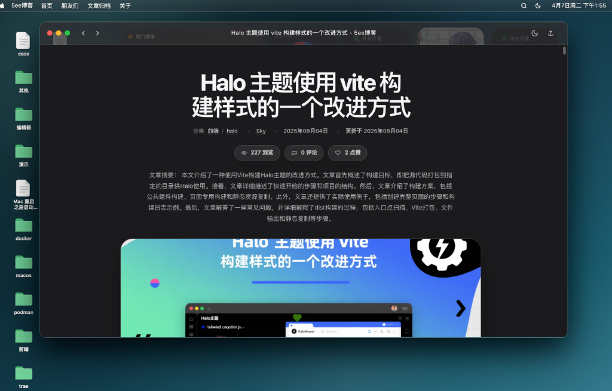
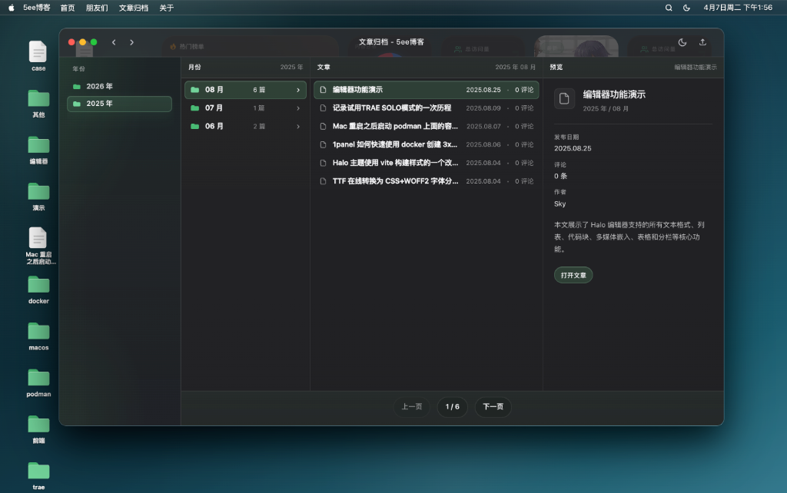
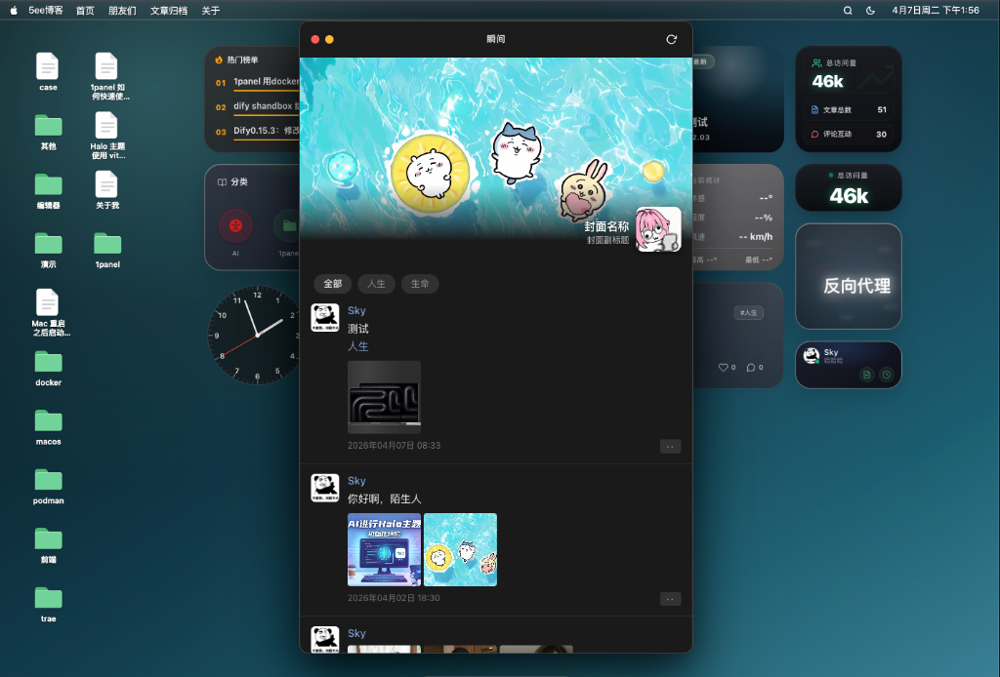
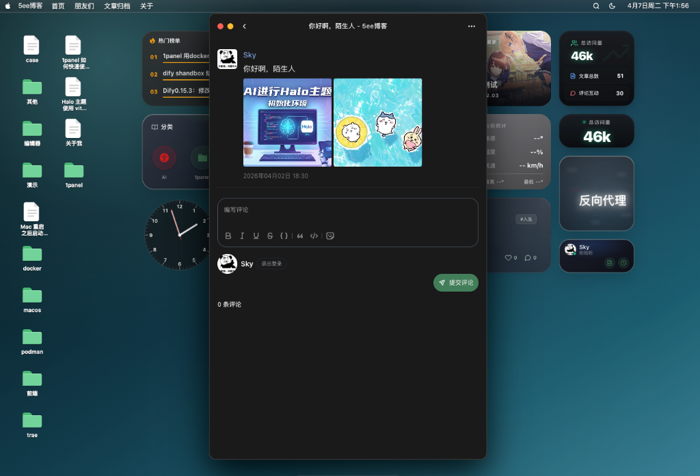

# Sky Blog 3

Sky Blog 3 是一个面向 Halo 2.x 的 macOS 桌面风格博客主题。主题以桌面、Dock、顶栏、窗口系统和桌面小组件为核心交互模型，将文章、归档、图库、瞬间、友链、追番、豆瓣、Steam、装备和 Docsme 等内容组织为独立 App。

- 仓库：[sky121666/theme-sky-blog-3](https://github.com/sky121666/theme-sky-blog-3)
- 当前版本：`v0.9.42`
- Halo 要求：`>= 2.25.0`
- 包管理器：`pnpm`

> Halo 兼容口径：`theme.yaml` 只声明最低要求 `>=2.25.0`；实际适配与运行验证以 Halo 最新稳定版 `2.25.4` 为准。本机 `2.25.4` 已通过 `pnpm run verify:reload` 与 `SMOKE_BASE_URL=http://localhost:8090 pnpm run smoke:playwright`。

## 预览

| 桌面 | 文章详情 |
| :---: | :---: |
|  |  |

| 归档 Finder | 瞬间列表 | 瞬间详情 |
| :---: | :---: | :---: |
|  |  |  |

## 核心特性

- macOS 桌面壳层：桌面、Dock、菜单栏、窗口、桌面图标和小组件统一调度。
- 独立 App 架构：归档、分类、标签、作者、文章、图库、瞬间、友链、追番、豆瓣、Steam、装备和 Docsme 均按 App 入口拆分。
- PJAX 窗口体验：内容页在主窗口内切换，保留桌面上下文，并对插件脚本重放、页面协议和滚动状态做适配。
- 桌面小组件：支持系统类、Halo 内容类和插件类小组件，按插件可用性进入组件中心。
- 移动端适配：核心 App 支持移动端全屏或紧凑布局，尽量保持桌面体验和触控体验一致。
- 插件契约管理：以文档记录已验证插件版本、接口边界、支持状态和后续风险。
- 构建产物内置：Halo 运行时直接加载 `templates/assets/**`，发布包可直接安装使用。

## 功能概览

| 模块 | 路由 / 能力 | 状态 |
| --- | --- | --- |
| 桌面壳层 | 首页、Dock、菜单栏、桌面图标、窗口系统 | 已完成 |
| 文章阅读 | 文章、页面、目录、点赞、评论、代码块 | 已完成 |
| 浏览器列表 | 归档、分类、标签、作者；分类/标签统一 Finder、元数据图标与颜色、明确分页路由 | 已完成 |
| 瞬间 | `/moments`、详情、发布、点赞、评论、媒体预览 | 已完成 |
| 图库 | `/photos`、`/photos/{name}`、稳定侧栏、分页内胶片条、左右/键盘切换、EXIF、评论抽屉 | 已完 |
| 友链 | `/links`、分组、留言板、申请表、管理员自动补全 | 已完成 |
| 追番 | `/bangumis`、类型/状态筛选、自动加载 | 已完成 |
| 豆瓣 | `/douban`、筛选、搜索、分页、Quick Look | 已完成 |
| Steam | `/steam`、资料、最近游玩、游戏库、徽章、热力图 | 已完成 |
| 装备 | `/equipments`、分组导航、单品展厅、自动加载 | 已完成 |
| Docsme | `/docs`、项目大厅、文档正文、目录页、同窗口 PJAX | 已完成 |

## 桌面小组件

主题已内置多类桌面小组件。插件类小组件会根据插件是否安装自动决定是否可用。

| 小组件 | 插件 / 数据源 | 尺寸 |
| --- | --- | --- |
| 图库 `plugin-photos.gallery` | `PluginPhotos` | small / medium / large |
| 追番 `plugin-bangumis.recent` | `plugin-bilibili-bangumi` | small / medium / large |
| 豆瓣 `plugin-douban.showcase` | `plugin-douban` | large |
| Steam `plugin-steam.summary` | `halo-plugin-steam` | medium |
| 朋友圈 `plugin-friends.recent` | `plugin-friends` | medium / large |
| Docsme `plugin-docsme.quick` | `plugin-docsme` | medium |
| Halo 内容小组件 | 分类、标签、最新文章、热门文章、站点统计、作者卡片 | 多尺寸 |
| 系统小组件 | 时钟、日历、天气 | 多尺寸 |

## 插件兼容

当前主题按以下插件版本完成适配或兼容复验。插件不是全部必装；未安装时，对应 App 或小组件会降级、隐藏或显示空状态。

| 插件 | 已验证版本 | 支持范围 |
| --- | --- | --- |
| `PluginMoments` | `1.16.1` | 瞬间列表、详情、评论、统计字段、媒体类型、标签筛选、可取消瀑布流分页 |
| `PluginPhotos` | `2.1.2` | 图库列表、分页重试、分组、详情、分页内胶片条、EXIF、桌面图库小组件 |
| `PluginLinks` | `2.0.0` | 友链列表、分组、留言板、访客手动申请、管理员自动补全 |
| `plugin-friends` | `1.4.6` | 朋友圈 feed、`linkName` 筛选、桌面朋友圈小组件 |
| `plugin-bilibili-bangumi` | `1.4.1` | 追番/追剧列表、类型筛选、状态筛选、分页加载、小组件 |
| `plugin-douban` | `1.2.5` | 书影音归档、筛选、搜索、分页、Quick Look、桌面豆瓣小组件 |
| `halo-plugin-steam` | `1.0.0` | Steam 资料、游戏库、最近游玩、徽章、热力图、小组件 |
| `plugin-docsme` | 核心能力 `1.7.0` | 文档项目、正文页、目录页、评论容器、同窗口 PJAX；权限/多语言/多版本仍按 `1.6.0` 样本边界 |
| `PluginCommentWidget` | 完整交互 `3.1.1`；资源 `3.1.2` | 文章、页面、瞬间、图库、Docsme、友链留言评论；3.1.2 仅完成资源加载核验 |
| `PluginSearchWidget` | `1.7.1` | 顶栏搜索入口、快捷键唤起、搜索弹窗样式变量 |
| `plugin-shiki` | `1.4.1` | 代码高亮、暗色模式、PJAX 增量渲染与额外路径脚本重放 |
| `equipment` | `1.1.1` | 装备页 SSR 路由兼容，公开 REST API 暂不接入 |
| `auth-passkey` | `1.0.4` | 登录页 Passkey 表单片段兼容 |
| `link-submit` | `1.0.7` | 友链自助提交、分组读取、失败后保留手动申请与留言兜底 |

以下插件提供 head/路由能力、由 Halo 页脚全局注入资源或提供内容自定义元素；主题验证 discovery、资源去重、PJAX 生命周期和只读展示，不代替插件自身的写入、支付、鉴权或模型调用测试。

| 插件 | 已验证版本 | 支持范围 |
| --- | --- | --- |
| `PluginFeed` | `1.5.0` | 插件可用时输出唯一 `/rss.xml` discovery，并验证 RSS 端点 |
| `plugin-katex` | `3.0.0` | 行内/块级公式、冷补载与失败回退 |
| `text-diagram` | `1.5.2` | Mermaid 明暗重绘、冷补载与重复执行 |
| `seo-tools` | `1.9.5` | 插件标签优先、客户端缺失补齐、去重与 PJAX head 同步 |
| `PluginLightGallery` | `1.2.1` | 冷 PJAX 挂载/销毁和实例泄漏防护 |
| `plugin-online` | `1.0.5` | 单 WebSocket、路径注册和私密页 history 语义 |
| `PluginContactForm` | 资源能力 `1.6.4` | 全局 loader 单实例；未执行真实表单提交 |
| `editor-hyperlink-card` | `1.9.2` | 块级/行内卡片升级与 PJAX 往返 |
| `lottery` | 展示能力 `1.0.2` | 抽奖卡展示与 PJAX 往返；未执行参与操作 |
| `restricted-reading` | 资源能力 `1.8.1` | 全局组件资源兼容；未执行解锁或支付 |
| `vote` | 展示能力 `1.1.3` | 投票块展示与 PJAX 往返；未执行投票 |
| `ai-assistant` | 资源能力 `2.2.4` | RAG UI 资源兼容；未调用模型或生成接口 |

完整适配边界见：

- [插件适配状态](docs/插件适配状态.md)
- [插件适配契约](docs/插件适配契约.md)
- [插件更新跟进计划](docs/插件更新跟进计划.md)

## 安装与升级

1. 前往 [Releases](https://github.com/sky121666/theme-sky-blog-3/releases) 下载最新主题包。
2. 在 Halo 后台进入 `外观 -> 主题`。
3. 上传 `theme-sky-blog-3-<version>.zip`。
4. 启用主题，并根据需要配置菜单、桌面图标、桌面小组件和插件页面。

升级时建议：

- 先备份主题配置。
- 确认 Halo 版本满足 `>= 2.25.0`。
- 按各行的 surface 验证边界确认插件版本；`PluginLinks` 必须精确为 `2.0.0`。
- 升级后刷新主题缓存，并检查首页、文章页和已启用插件页面。

## 开发

本项目只使用 `pnpm`。不要使用 `npm`、`npx`、`yarn` 或 `bun`。

```bash
pnpm install
pnpm run build-only
pnpm run typecheck
pnpm run lint
pnpm run verify:reload
SMOKE_BASE_URL="http://localhost:8090" pnpm run smoke:playwright
```

常用脚本：

| 命令 | 用途 |
| --- | --- |
| `pnpm run build-only` | 生成 `templates/assets/**` 静态资源 |
| `pnpm run typecheck` | 校验主题协议和资源清单 |
| `pnpm run lint` | 校验架构约束 |
| `pnpm run verify:reload` | 调用 Halo 主题 reload 并检查关键页面 |
| `pnpm run smoke:playwright` | 使用 Playwright 验证主要页面和 PJAX 协议 |
| `pnpm run verify:photos:view-transition` | 验证图库单图共享过渡、稳定侧栏、胶片条与清理边界 |
| `pnpm run verify:tags` | 验证标签统一 Finder、分页路由、无骨架 PJAX 与无障碍静态契约 |
| `SMOKE_BASE_URL="http://localhost:8090" pnpm run verify:tags:live` | 验证标签根页、详情、分页、history、越界恢复和三档响应式真页 |
| `pnpm run verify:plugins:all` | 重新构建后严格检查 26 个已知前台插件、必达路由、真页生命周期、性能与 PJAX |
| `pnpm run verify:performance` | 强制 HTML、gzip 与插件资源数量预算 |
| `pnpm run verify:pjax-lifecycle` | 执行完整 PJAX 与 20 轮同 variant 往返，检查监听器、CSS 和滚动容器 registry 生命周期 |
| `pnpm run audit:licenses` | 扫描完整依赖许可证策略 |
| `pnpm run audit:security` | 经明确授权后向 npm 官方漏洞接口扫描生产与完整依赖图 |
| `pnpm run build` | 构建并打包主题 |

注意：`templates/assets/**` 是 Halo 实际加载的运行时产物。修改 `src/**` 后必须重新构建并同步这些文件。

## 发布流程

```bash
pnpm run build-only
pnpm run typecheck
pnpm run lint
pnpm run verify:reload
SMOKE_BASE_URL="http://localhost:8090" pnpm run smoke:playwright
PERF_BASE_URL="http://localhost:8090" pnpm run verify:performance
SMOKE_BASE_URL="http://localhost:8090" pnpm run verify:pjax-lifecycle
```

发布版本时同步更新：

- `package.json`
- `theme.yaml`
- `docs/发布说明.md`
- `templates/assets/**`

本仓库保留原有发布流程：CI 负责安装、检查以及按仓库变量选择性执行浏览器 smoke；CD 在 GitHub Release 公开后调用 Halo 官方 `theme-cd.yaml@v4`，完成主题发布与 Halo 应用市场同步。Halo 版本适配不改写 CI/CD，只在 `theme.yaml` 声明最低版本，并以最新稳定版完成发布前本地验证。

发布前必须确认：仓库 Secret `HALO_PAT` 已配置，并在 Halo 应用市场开发者中心具备目标应用的“版本管理”权限；`theme.yaml` 的 `metadata.annotations["store.halo.run/app-id"]` 必须与 `.github/workflows/cd.yaml` 的 `app-id` 一致，当前均为 `app-gqnoxtpt`。

漏洞审计会把解析后的依赖树提交到 npm 官方漏洞接口，因此只能在维护者明确授权后手动执行；本轮仓库变量 `NPM_AUDIT_ALLOWED=true` 已按授权设置，但不改变原有 CI/CD 流程。

## 当前限制

- 友链自动补全仅支持管理员角色；访客和普通用户默认使用手动申请表。
- 不支持旧版 `PluginLinks/link-detail` 匿名提取接口。
- `PluginPhotos` 公共 REST、tag、ungrouped 和详情预取暂未接入。
- Docsme / Moments 的 Shiki 真实代码块样本仍需继续补充复验。
- `plugin-forum` 不在本主题适配范围内。

## 文档

- [文档索引](docs/文档索引.md)
- [架构总览](docs/架构总览.md)
- [开发约束](docs/开发约束.md)
- [代码质量评估](docs/代码质量评估.md)
- [后台设置协助说明](docs/设置/后台设置协助说明.md)
- [图标与注解设置指南](docs/设置/图标与注解设置指南.md)
- [桌面小组件](docs/桌面小组件.md)
- [项目进度](docs/项目进度.md)
- [发布说明](docs/发布说明.md)
- [发布与回滚](docs/发布与回滚.md)

## 反馈

- GitHub Issues：[提交问题或建议](https://github.com/sky121666/theme-sky-blog-3/issues)
- Release 下载：[版本发布页](https://github.com/sky121666/theme-sky-blog-3/releases)
- 加入社群：通过下方二维码交流使用问题和功能建议

| 企业微信（备注进群） | QQ 群 |
| :---: | :---: |
|  |  |

> 卖服务器的广告人，就不要加了。
