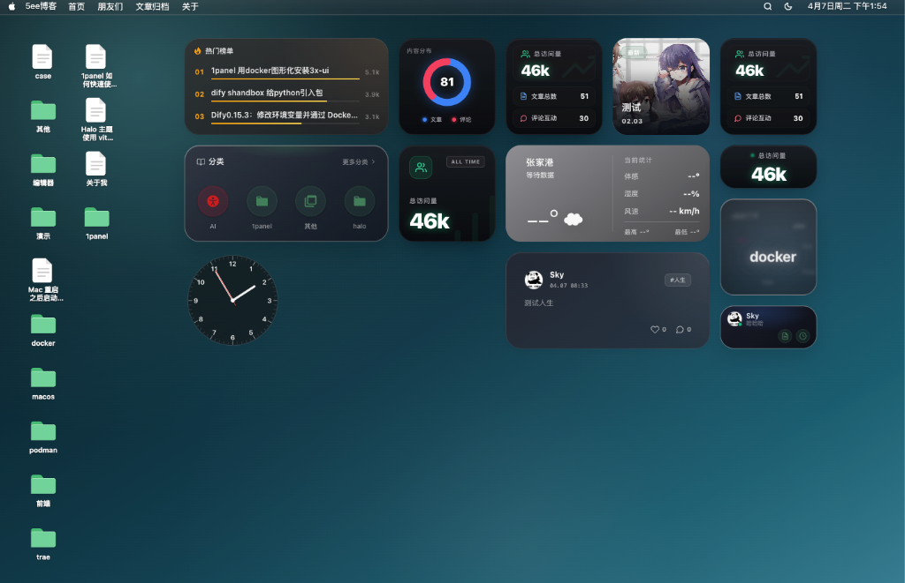
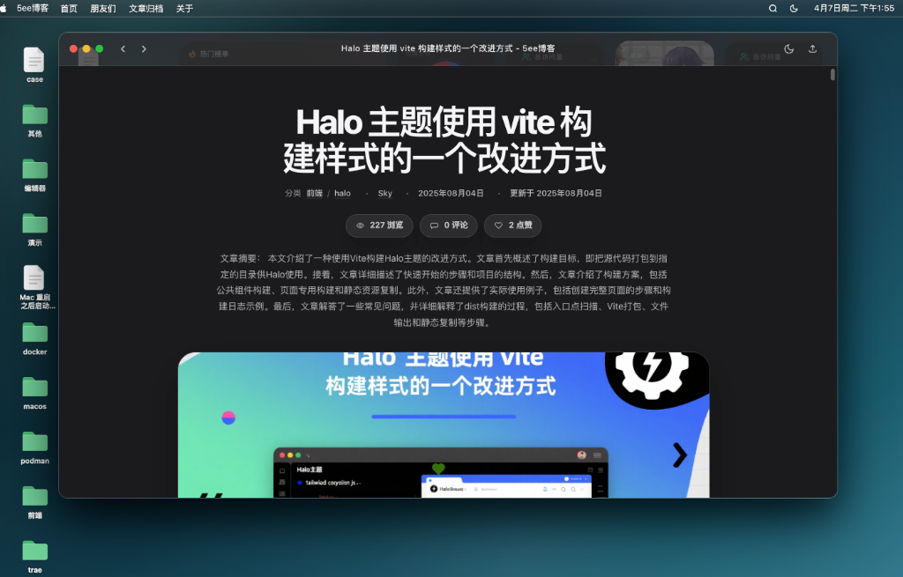
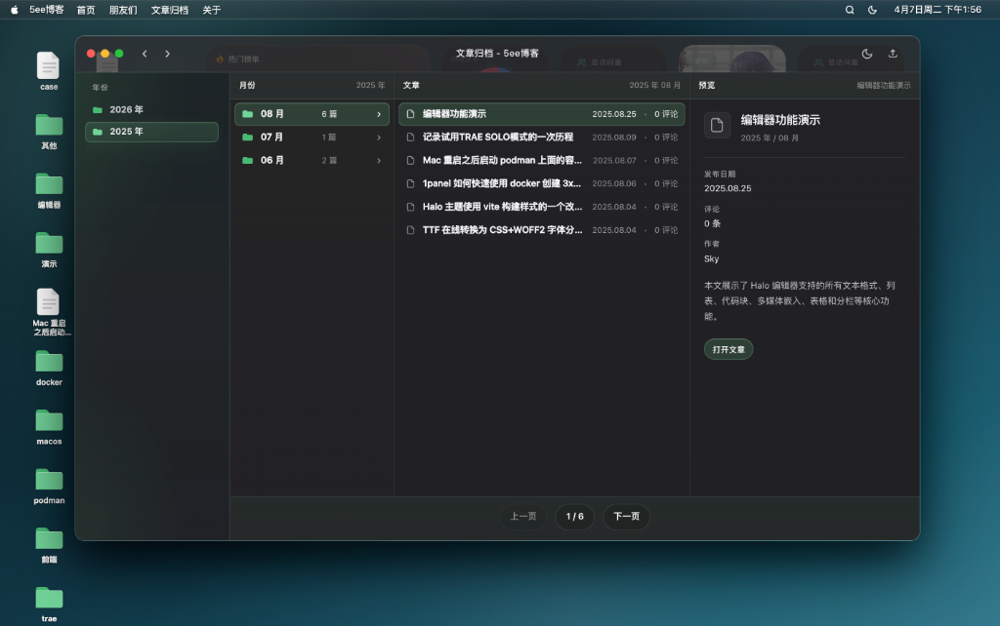
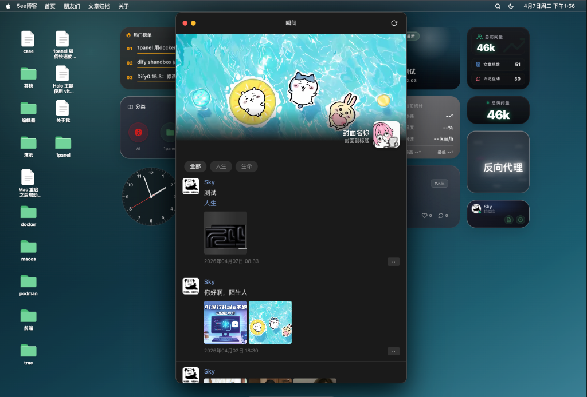
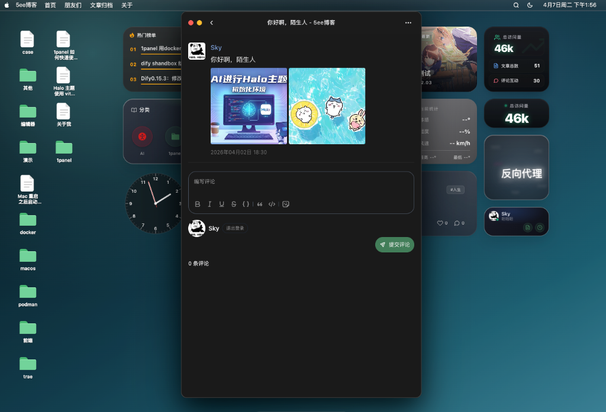

# Sky Blog 3

Sky Blog 3 是一个面向 Halo 2.x 的 macOS 桌面风格博客主题。主题以桌面、Dock、顶栏、窗口系统和桌面小组件为核心交互模型，将文章、归档、图库、瞬间、友链、追番、豆瓣、Steam、装备和 Docsme 等内容组织为独立 App。

- 仓库：[sky121666/theme-sky-blog-3](https://github.com/sky121666/theme-sky-blog-3)
- 当前版本：`v0.9.46`
- Halo 要求：`>= 2.26.0`
- 包管理器：`pnpm`

> 当前本地提交、精确构建及已验证范围统一见[项目进度：当前状态](docs/项目进度.md#当前状态)，后续页面接入遵循[主题导航契约](docs/主题导航契约.md)。本次按功能分批本地提交，未推送或发布；下面其他构建结果保留为历史记录。

> 2026-09-28 历史本地构建 `0.9.46/3ffdcb99a0b4` 修复特殊链接的 PJAX 接管边界与 Docsme 正文内链绑定。在 Halo `2.26.1`、`plugin-docsme 1.10.0` 上通过 Node 24 检查、主题重载、24 场景 smoke、46 页双端只读巡检及 Docsme 7 项专项；KaTeX 真页缺样本。范围与剩余边界见[PJAX 链接验证](docs/2026-09-28-PJAX-链接边界与Docsme正文.md)。上一构建 `ad3e2b2cd2ee` 的登录密码显隐按钮只有桌面/手机匿名登录页只读操作证据（本机 `output/auth-audit/anonymous-auth-results.json`，未提交表单）；再前一构建 `1fd18f4f082f` 的专用账号真实登录见[历史登录验证](docs/2026-09-28-登录片段加密修复.md)。旧构建结果不外推到现行构建。

> Halo 兼容口径：`theme.yaml` 已将最低要求提高至 `>=2.26.0`，与当前目标稳定插件组合的最高最低要求一致；Halo 2.25.x 不再属于本主题声明的支持范围。2026-09-26 在本机 Halo `2.26.1` 启用主题三，并核对 45 个安装项、24 个主题目标插件。当日历史结果见 [逐页适配验收](docs/2026-09-26-逐页适配验收.md)，51 个功能范围与文件标识见 [插件适配契约](docs/插件适配契约.md#当前逐-surface-权威表2026-09-26)；当前构建和未验场景以最新验收记录为准。

> 2026-09-27 历史本地构建 `0.9.46 / acc35d74a2e5` 已在 Halo `2.26.1` 完成构建、重载、严格 smoke，并实测专用文章/动态的评论、点赞、投票及主题设置保存恢复；见[本地写链验收](docs/2026-09-27-Halo-本地写链验收.md)。专用内容已清理，仍残留一条动态点赞 Counter，不能写成完整回滚。用户删除 Docsme 项目后，`/docs` 不再输出旧 `/docs/123` 卡片，旧地址的 404 属预期；Docsme 复测对照（本机 `docs/evidence/docsme-after-delete-2026-09-27/README.md`）显示指定 Node 24 的完整专项两轮一败一过，有效文档间歇导航超时未排除，KaTeX 仍缺真实样本。此前 `fe9f8bf846f2` 的阅读器锚点真页结果见[只读验收与目录修复](docs/2026-09-27-主题三后续只读验收与目录修复.md)，`ea0f0025528d` 的双端逐页及逐插件验收见[支持范围与界面验收](docs/2026-09-27-Halo-2.26-支持范围与界面验收.md)，均不自动外推到新构建。其他写链和缺样本功能仍待验；下列功能状态描述实现范围，不等于所有业务流程已通过。

## 预览

| 桌面 | 文章详情 |
| :---: | :---: |
|  |  |

| 归档 Finder | 瞬间列表 | 瞬间详情 |
| :---: | :---: | :---: |
|  |  |  |

## 核心特性

- macOS 桌面壳层：桌面、Dock、菜单栏、窗口、桌面图标和小组件统一调度。
- Halo 2.26+ 页面布局契约：`templates/layout.html` 提供 `html(head, content)`，供调用该契约的插件自带前台页面使用；主题自有 App 页面继续使用私有桌面布局。本机 Halo 2.26.1 曾在重载后报告 `Theme.status.pageLayout=SUPPORTED`，这只确认静态签名。当前主题覆盖了瞬间等插件的同名模板，仍缺实际调用新增布局的真页渲染验收。
- 独立 App 架构：归档、分类、标签、作者、文章、图库、瞬间、友链、追番、豆瓣、Steam、装备和 Docsme 均按 App 入口拆分。
- PJAX 窗口体验：内容页在主窗口内切换，保留桌面上下文，并对插件脚本重放、页面协议和滚动状态做适配。
- 桌面小组件：支持系统类、Halo 内容类和插件类小组件，按插件可用性进入组件中心。
- 管理员前端系统设置：具备主题配置权限的登录用户可通过 macOS 风格九分类窗口编辑对应的后台主题配置，涵盖外观、墙纸、Dock、菜单栏、导航菜单、小组件、通知中心、应用和高级设置；真实 Dock、小组件和菜单栏会即时联动，Halo 主题配置仍是唯一数据源。
- 内置图片与图标选择器：前端设置直接调用 Halo 附件库，支持墙纸、小组件回退封面、瞬间封面和 Steam 背景的搜索、选择、上传和图片地址；顶栏与豆瓣图标支持按需加载的 Iconify 图标集浏览、搜索及颜色设置。附件操作继续受 Halo 权限和存储策略约束，详见[使用说明](docs/设置/前端图片与图标设置.md)。
- macOS 锁屏式登录：本地账号采用用户名与密码两步流程，密码框支持显隐切换；动态保留 Halo 提供的第三方登录和通行密钥入口，并适配明暗色、移动端、键盘与减少动态效果偏好。
- 移动端适配：核心 App 支持移动端全屏或紧凑布局，尽量保持桌面体验和触控体验一致。
- 插件契约管理：以文档记录已验证插件版本、接口边界、支持状态和后续风险。
- 构建产物内置：Halo 运行时直接加载 `templates/assets/**`，发布包可直接安装使用。

## 功能概览

| 模块 | 路由 / 能力 | 实现状态（运行范围见验收记录） |
| --- | --- | --- |
| 桌面壳层 | 首页、Dock、菜单栏、桌面图标、窗口系统 | 已完成 |
| 前端系统设置 | 9 分类对应 73 个后台字段路径；附件库、图标选择、资源挂载、草稿预览与冲突提示 | 使用流程见[前端系统设置](docs/设置/前端系统设置.md)，验证范围见[当前状态](docs/项目进度.md#当前状态) |
| 文章阅读 | 文章、页面、目录、点赞、评论、代码块 | 已完成 |
| 浏览器列表 | 归档、分类、标签、作者；分类/标签统一 Finder、元数据图标与颜色、明确分页路由 | 已完成 |
| 瞬间 | `/moments`、详情、发布、点赞、评论、媒体预览 | 已完成 |
| 图库 | `/photos`、`/photos/{name}`、稳定侧栏、分页内胶片条、左右/键盘切换、EXIF、评论抽屉 | 已完 |
| 友链与朋友圈 | `/links`、分组、RSS 朋友圈、收藏、稍后阅读、已读状态、留言板、权限感知添加助手 | 已完成 |
| 追番 | `/bangumis`、类型/状态筛选、自动加载 | 已完成 |
| 豆瓣 | `/douban`、筛选、搜索、分页、Quick Look | 已完成 |
| Steam | `/steam`、资料、最近游玩、游戏库、徽章、热力图 | 已完成 |
| 装备 | `/equipments`、分组导航、单品展厅、自动加载 | 已完成 |
| Docsme | `/docs`、项目大厅、文档正文、目录页、同窗口 PJAX | 已完成 |

## 桌面小组件

主题已内置多类桌面小组件。插件类小组件会根据插件是否安装自动决定是否可用。

| 小组件 | 插件 / 数据源 | 尺寸 |
| --- | --- | --- |
| 图库 `plugin-photos.gallery` | `PluginPhotos` | small / medium / large |
| 追番 `plugin-bangumis.recent` | `plugin-bilibili-bangumi` | small / medium / large |
| 豆瓣 `plugin-douban.showcase` | `plugin-douban` | large |
| Steam `plugin-steam.summary` | `halo-plugin-steam` | medium |
| 朋友圈 `plugin-links.feed` | `PluginLinks` RSS | small / medium / large |
| Docsme `plugin-docsme.quick` | `plugin-docsme` | medium |
| Halo 内容小组件 | 分类、标签、最新文章、热门文章、站点统计、作者卡片 | 多尺寸 |
| 系统小组件 | 时钟、日历、天气 | 多尺寸 |

## 插件兼容

本轮 24 插件的目标、官方依据、实际修改、验证与剩余问题见 [逐插件交付表](docs/2026-09-26-逐页适配验收.md#逐插件交付表)；发布日期、最低 Halo、技能基线见 [版本核验表](docs/2026-09-25-插件适配核验.md)。下列“已验证版本”保留 2026-07-22 等历史主题代码的验收记录，不能视为当前工作区证据；本机 `PluginMoments 1.19.0`、`PluginCommentWidget 3.3.2` 和 `vote 1.1.3` 的部分真实写链已于 2026-09-27 增量验证，精确范围见[本地写链验收](docs/2026-09-27-Halo-本地写链验收.md)。插件不是全部必装；未安装时，对应 App 或小组件会降级、隐藏或显示空状态。

| 插件 | 已验证版本 | 支持范围 |
| --- | --- | --- |
| `PluginMoments` | `1.16.1` | 瞬间列表、详情、评论、统计字段、媒体类型、标签筛选、可取消瀑布流分页 |
| `PluginPhotos` | `2.1.2` | 图库列表、分页重试、分组、详情、分页内胶片条、EXIF、桌面图库小组件 |
| `PluginLinks` | `2.2.1` | 友链列表、分组、RSS 朋友圈、游标续载、收藏、稍后阅读、已读状态、留言板、权限感知识别与添加、桌面朋友圈小组件 |
| `plugin-bilibili-bangumi` | `1.4.1` | 追番/追剧列表、类型筛选、状态筛选、分页加载、小组件 |
| `plugin-douban` | `1.2.5` | 书影音归档、筛选、搜索、分页、Quick Look、桌面豆瓣小组件 |
| `halo-plugin-steam` | `1.0.0` | Steam 资料、游戏库、最近游玩、徽章、热力图、小组件 |
| `plugin-docsme` | 核心能力 `1.7.0` | 文档项目、正文页、目录页、评论容器、同窗口 PJAX；权限/多语言/多版本仍按 `1.6.0` 样本边界 |
| `PluginCommentWidget` | 完整交互 `3.1.1`；资源 `3.1.2` | 文章、页面、瞬间、图库、Docsme、友链留言评论；3.1.2 仅完成资源加载核验 |
| `PluginSearchWidget` | `1.7.1` | 顶栏搜索入口、快捷键唤起、搜索弹窗样式变量 |
| `plugin-shiki` | `1.4.1` | 代码高亮、暗色模式、PJAX 增量渲染与额外路径脚本重放 |
| `equipment` | `1.1.1` | 装备页 SSR 路由兼容，公开 REST API 暂不接入 |
| `auth-passkey` | `1.0.4` | 登录页 Passkey 表单片段兼容 |

以下插件提供 head/路由能力、由 Halo 页脚全局注入资源或提供内容自定义元素；主题验证 discovery、资源去重、PJAX 生命周期和只读展示，不代替插件自身的写入、支付、鉴权或模型调用测试。

| 插件 | 已验证版本 | 支持范围 |
| --- | --- | --- |
| `PluginFeed` | `1.5.0` | 插件可用时输出唯一 `/rss.xml` discovery，并验证 RSS 端点 |
| `plugin-katex` | `3.0.0` | 行内/块级公式、冷补载与失败回退 |
| `text-diagram` | `1.5.2` | Mermaid 明暗重绘、冷补载与重复执行 |
| `seo-tools` | `1.9.5` | 插件标签优先、客户端缺失补齐、去重与 PJAX head 同步 |
| `PluginLightGallery` | `1.2.1` | 冷 PJAX 挂载/销毁和实例泄漏防护 |
| `plugin-online` | `1.0.5` | 单 WebSocket、路径注册和私密页 history 语义 |
| `PluginContactForm` | 资源能力 `1.6.4` | 全局 loader 单实例；未执行真实表单提交 |
| `editor-hyperlink-card` | `1.9.2` | 块级/行内卡片升级与 PJAX 往返 |
| `lottery` | 展示能力 `1.0.2` | 抽奖卡展示与 PJAX 往返；未执行参与操作 |
| `restricted-reading` | 资源能力 `1.8.1` | 全局组件资源兼容；未执行解锁或支付 |
| `vote` | 展示能力 `1.1.3` | 历史批次仅验证投票块展示与 PJAX 往返；当前专用文章的实际投票结果见上方增量报告 |
| `ai-assistant` | 资源能力 `2.2.4` | RAG UI 资源兼容；未调用模型或生成接口 |

完整适配边界见：

- [插件适配状态](docs/插件适配状态.md)
- [插件适配契约](docs/插件适配契约.md)
- [2026-09-25 插件适配核验](docs/2026-09-25-插件适配核验.md)
- [2026-09-27 上一构建逐插件结果](docs/2026-09-27-后续收口与验证.md)
- [2026-09-27 Halo 2.26 支持范围与界面验收](docs/2026-09-27-Halo-2.26-支持范围与界面验收.md)
- [插件更新跟进计划](docs/插件更新跟进计划.md)

## 安装与升级

1. 前往 [Releases](https://github.com/sky121666/theme-sky-blog-3/releases) 下载最新主题包。
2. 在 Halo 后台进入 `外观 -> 主题`。
3. 上传 `theme-sky-blog-3-<version>.zip`。
4. 启用主题，并根据需要配置菜单、桌面图标、桌面小组件和插件页面。

升级时建议：

- 先备份主题配置。
- 确认 Halo 版本满足 `>= 2.26.0`。
- 按当日适配核验表确认插件版本。既有局部真页记录不覆盖全部功能；友链、归档、Docsme 的历史专项失败与新页面布局待验范围见修复记录及最新验收记录。
- 升级后刷新主题缓存，并检查首页、文章页和已启用插件页面。

## 开发

本项目只使用 `pnpm`。不要使用 `npm`、`npx`、`yarn` 或 `bun`。

开发与构建固定使用 Node `24.21.0`（24 LTS）和 pnpm `12.5.1`。先切换到对应 Node，再用 `corepack pnpm --version` 确认项目的 `packageManager` 版本；未配置 pnpm 命令时，可用 `corepack pnpm` 代替下列命令中的 `pnpm`。依赖采用精确版本和 7 天发布等待期，禁止把较新的预发布或未满等待期版本直接装入。版本选择及本轮验证见 [稳定依赖升级记录](docs/2026-09-26-稳定依赖升级.md)。

```bash
pnpm install --frozen-lockfile
pnpm run build-only
pnpm run typecheck
pnpm run lint
pnpm run verify:reload
SMOKE_BASE_URL="http://localhost:8090" pnpm run smoke:playwright
```

常用脚本：

| 命令 | 用途 |
| --- | --- |
| `pnpm run build-only` | 生成 `templates/assets/**` 静态资源 |
| `pnpm run typecheck` | 校验主题协议和资源清单 |
| `pnpm run verify:halo-page-layout` | 检查 Halo 插件页面布局的片段、配色和基础样式契约 |
| `pnpm run lint` | 校验架构约束 |
| `pnpm run verify:reload` | 调用 Halo 主题 reload 并检查关键页面 |
| `pnpm run verify:settings-model` | 验证后台字段映射、设置动作、资源读取及布局同步 |
| `pnpm run verify:settings-assets` | 验证前端附件请求、图片/图标字段、选择器取消与设置预览 |
| `pnpm run smoke:playwright` | 使用 Playwright 验证主要页面和 PJAX 协议 |
| `pnpm run verify:photos:view-transition` | 验证图库单图共享过渡、稳定侧栏、胶片条与清理边界 |
| `pnpm run verify:tags` | 验证标签统一 Finder、分页路由、无骨架 PJAX 与无障碍静态契约 |
| `SMOKE_BASE_URL="http://localhost:8090" pnpm run verify:tags:live` | 验证标签根页、详情、分页、history、越界恢复和三档响应式真页 |
| `pnpm run verify:plugins:all` | 重新构建后严格检查 24 个当前目标插件、必达路由、真页生命周期、性能与 PJAX；任一真页失败即停止 |
| `pnpm run verify:performance` | 强制 HTML、gzip 与插件资源数量预算 |
| `pnpm run verify:pjax-lifecycle` | 执行完整 PJAX 与 20 轮同 variant 往返，检查监听器、CSS 和滚动容器 registry 生命周期 |
| `pnpm run audit:licenses` | 扫描完整依赖许可证策略 |
| `pnpm run audit:security` | 经明确授权后向 npm 官方漏洞接口扫描生产与完整依赖图 |
| `pnpm run build` | 构建并打包主题 |

注意：`templates/assets/**` 是 Halo 实际加载的运行时产物。修改 `src/**` 后必须重新构建并同步这些文件。

## 发布流程

```bash
pnpm run build-only
pnpm run typecheck
pnpm run lint
pnpm run verify:reload
SMOKE_BASE_URL="http://localhost:8090" pnpm run smoke:playwright
PERF_BASE_URL="http://localhost:8090" pnpm run verify:performance
SMOKE_BASE_URL="http://localhost:8090" pnpm run verify:pjax-lifecycle
```

发布版本时同步更新：

- `package.json`
- `theme.yaml`
- `docs/发布说明.md`
- `templates/assets/**`

每次修改后在本地完成检查、构建和相关页面验证，结果对应最终提交代码。CI 仅通过 GitHub Actions 的 `Run workflow` 手动运行，普通推送和 Pull Request 不自动触发；手动运行会先安装 Chromium，再执行检查，并按仓库变量选择性执行真实站点 smoke。CD 在 GitHub Release 公开后调用 Halo 官方 `theme-cd.yaml@v4`，完成主题发布与 Halo 应用市场同步。Halo 最低版本由 `theme.yaml` 声明，并以最新稳定版完成发布前本地验证。

发布前必须确认：仓库 Secret `HALO_PAT` 已配置，并在 Halo 应用市场开发者中心具备目标应用的“版本管理”权限；`theme.yaml` 的 `metadata.annotations["store.halo.run/app-id"]` 必须与 `.github/workflows/cd.yaml` 的 `app-id` 一致，当前均为 `app-gqnoxtpt`。

漏洞审计会把解析后的依赖树提交到 npm 官方漏洞接口，因此只能在维护者明确授权后手动执行；本轮仓库变量 `NPM_AUDIT_ALLOWED=true` 已按授权设置，但不改变原有 CI/CD 流程。

## 当前限制

- 访客侧友链元数据识别受目标站点 CORS、HTTPS 混合内容、非 HTML 响应和超时限制；识别失败会保留网址并要求手动补充。已登录且具链接管理权限时改用 PluginLinks 官方受保护识别接口。
- PluginLinks 未开启公开 RSS 时，朋友圈显示明确空态；不会回退到已经退出主题契约的旧朋友圈插件。
- `PluginPhotos` 公共 REST、tag、ungrouped 和详情预取暂未接入。
- Docsme 已有真实 Shiki 代码块的历史样本验证，不自动外推到现行构建；Moments / 独立页仍缺真实代码块样本，待补验。
- `plugin-forum` 不在本主题适配范围内。

## 文档

- [文档索引](docs/文档索引.md)
- [架构总览](docs/架构总览.md)
- [开发约束](docs/开发约束.md)
- [代码质量评估](docs/代码质量评估.md)
- [后台设置协助说明](docs/设置/后台设置协助说明.md)
- [前端系统设置](docs/设置/前端系统设置.md)
- [前端图片与图标设置](docs/设置/前端图片与图标设置.md)
- [图标与注解设置指南](docs/设置/图标与注解设置指南.md)
- [桌面小组件](docs/桌面小组件.md)
- [项目进度](docs/项目进度.md)
- [发布说明](docs/发布说明.md)
- [发布与回滚](docs/发布与回滚.md)

## 反馈

- GitHub Issues：[提交问题或建议](https://github.com/sky121666/theme-sky-blog-3/issues)
- Release 下载：[版本发布页](https://github.com/sky121666/theme-sky-blog-3/releases)
- 加入社群：通过下方二维码交流使用问题和功能建议

| 企业微信（备注进群） | QQ 群 |
| :---: | :---: |
|  |  |

> 卖服务器的广告人，就不要加了。
