# Sky Blog 3

Sky Blog 3 是面向 Halo 的 macOS 桌面风格博客主题。把文章、生活记录和兴趣收藏放进一张桌面：通过 Dock 打开内容，在窗口中浏览，再回到桌面。

- 当前正式版本：[v0.9.47](https://github.com/sky121666/theme-sky-blog-3/releases/tag/v0.9.47)，要求 Halo `>=2.26.0`
- 获取主题：[GitHub Releases](https://github.com/sky121666/theme-sky-blog-3/releases) · [Halo 应用市场](https://www.halo.run/store/apps/app-gqnoxtpt)
- 使用指南：[文档索引](docs/文档索引.md) · [完整功能截图](docs/功能展示.md)

## 功能总览

每个功能放一张代表图，点击图片或「详细截图」查看编号图集；具体操作见「使用说明」。截图来自 `v0.9.47` 的真实界面，采集于 **2026-10-02**。

| 桌面与个性化 | 内容与社交 | 兴趣、文档与手机 |
| :---: | :---: | :---: |
| **桌面与窗口**：图标、Dock、窗口最小化与恢复。 | **Finder 浏览**：分类、归档、标签与作者文章预览。 | **豆瓣书影音**：书影音筛选与 Quick Look 预览。 |
| [](docs/功能/桌面壳层/截图.md) | [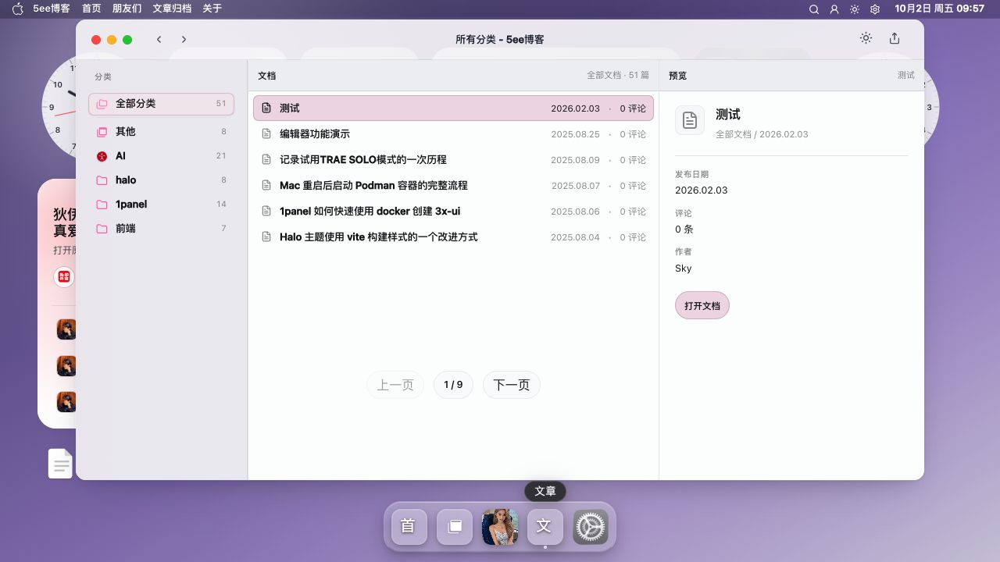](docs/功能/浏览列表/截图.md) | [](docs/功能/豆瓣/截图.md) |
| [详细截图](docs/功能/桌面壳层/截图.md) · [使用说明](docs/功能/桌面壳层.md) | [详细截图](docs/功能/浏览列表/截图.md) · [使用说明](docs/功能/浏览列表.md) | [详细截图](docs/功能/豆瓣/截图.md) · [使用说明](docs/功能/豆瓣.md) |
| **系统设置**：分类设置、外观预览与草稿应用。 | **文章与页面**：文章和独立页面、目录与正文阅读。 | **Steam**：游戏库、搜索与排序。 |
| [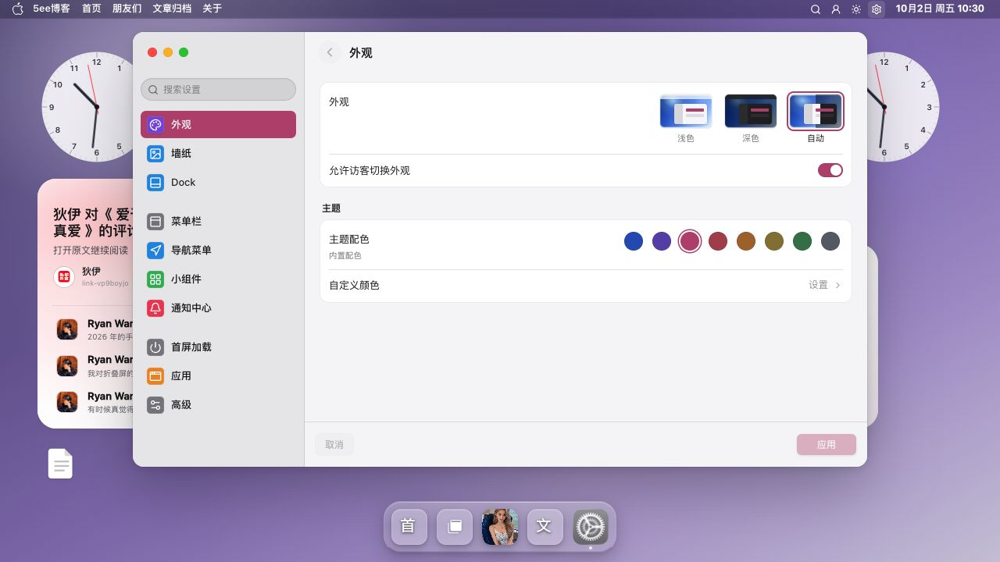](docs/功能/系统设置/截图.md) | [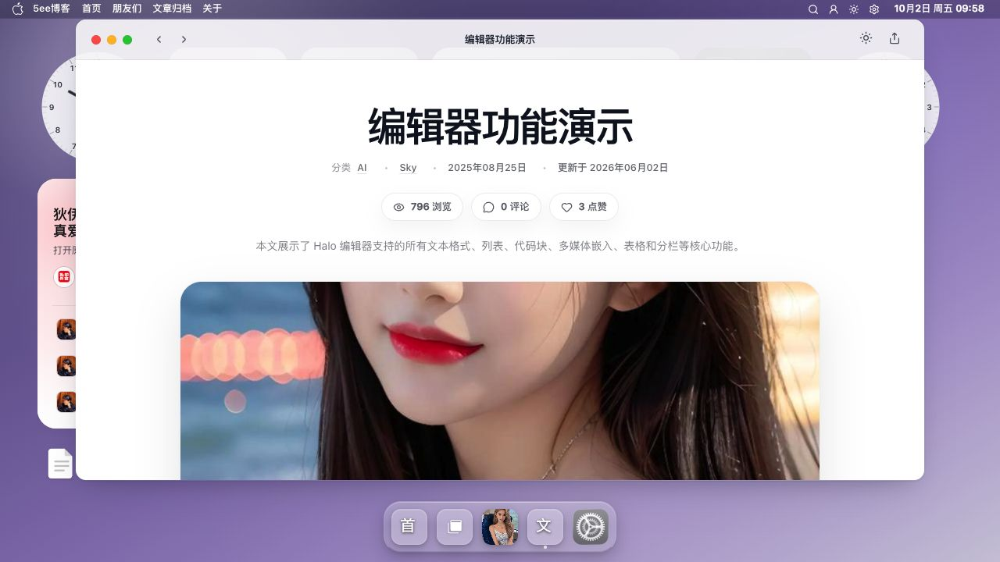](docs/功能/阅读页/截图.md) | [](docs/功能/Steam/截图.md) |
| [详细截图](docs/功能/系统设置/截图.md) · [使用说明](docs/设置/前端系统设置.md) | [详细截图](docs/功能/阅读页/截图.md) · [使用说明](docs/功能/阅读页.md) | [详细截图](docs/功能/Steam/截图.md) · [使用说明](docs/功能/Steam.md) |
| **图片与图标**：附件图片、图片地址与 Iconify 图标。 | **瞬间**：标签、图文动态与详情浏览。 | **追番追剧**：类型与状态筛选、卡片列表。 |
| [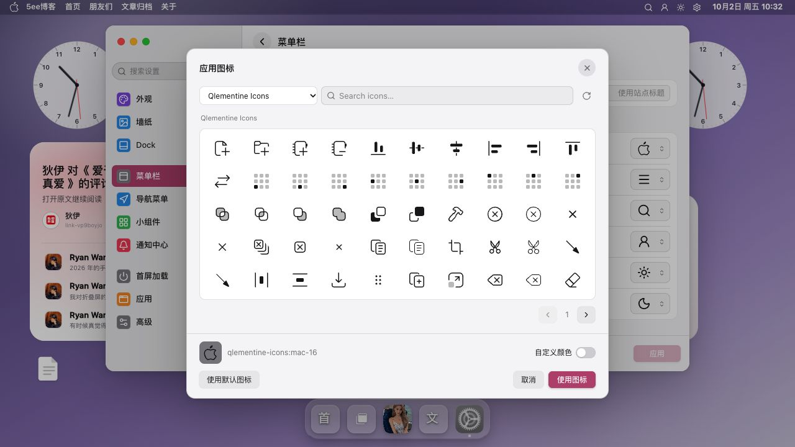](docs/功能/图片与图标/截图.md) | [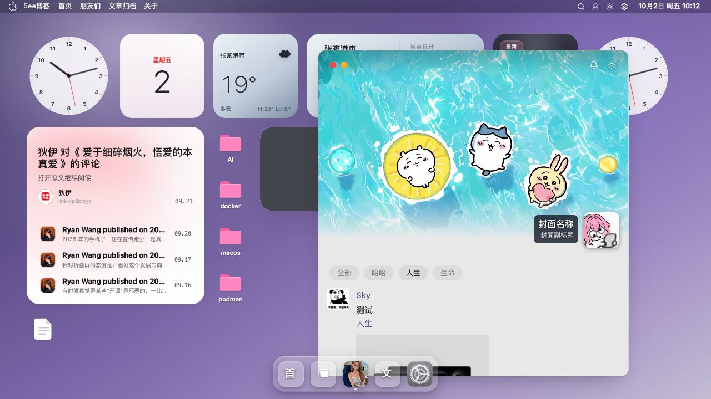](docs/功能/瞬间/截图.md) | [](docs/功能/追番/截图.md) |
| [详细截图](docs/功能/图片与图标/截图.md) · [使用说明](docs/设置/前端图片与图标设置.md) | [详细截图](docs/功能/瞬间/截图.md) · [使用说明](docs/功能/瞬间.md) | [详细截图](docs/功能/追番/截图.md) · [使用说明](docs/功能/追番.md) |
| **桌面小组件**：组件分类、尺寸外观与默认布局。 | **图库**：相册分组、瀑布流与图片详情。 | **装备**：分组展示设备信息与外链。 |
| [](docs/功能/桌面小组件/截图.md) | [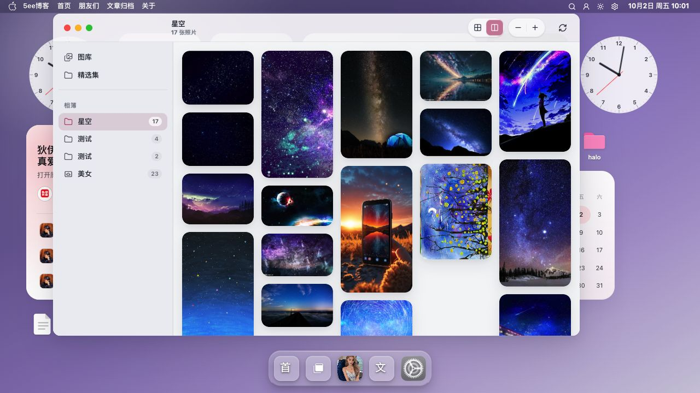](docs/功能/图库/截图.md) | [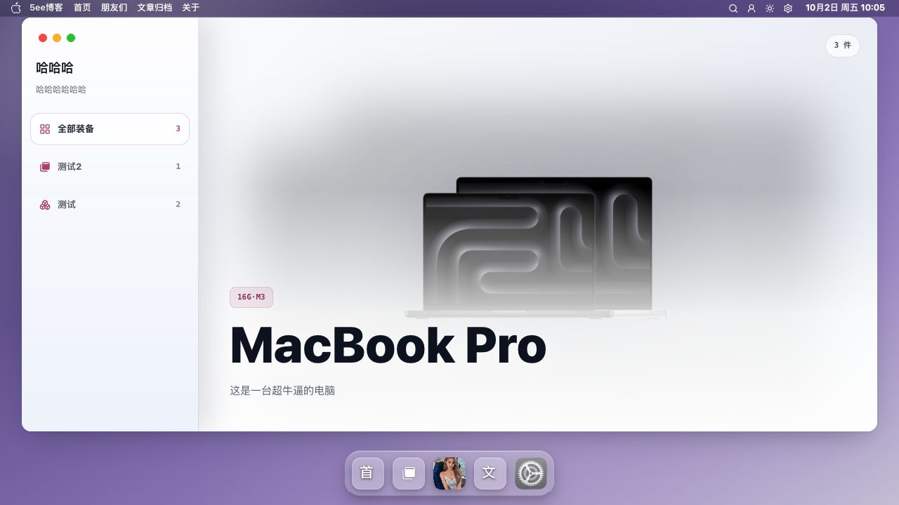](docs/功能/装备/截图.md) |
| [详细截图](docs/功能/桌面小组件/截图.md) · [使用说明](docs/桌面小组件.md) | [详细截图](docs/功能/图库/截图.md) · [使用说明](docs/功能/图库.md) | [详细截图](docs/功能/装备/截图.md) · [使用说明](docs/功能/装备.md) |
| **首屏加载**：普通显示、开机效果与播放频率。 | **友链**：站点分组、详情与申请入口。 | **Docsme 文档**：项目、版本、文档树与正文目录。 |
| [](docs/功能/首屏加载/截图.md) | [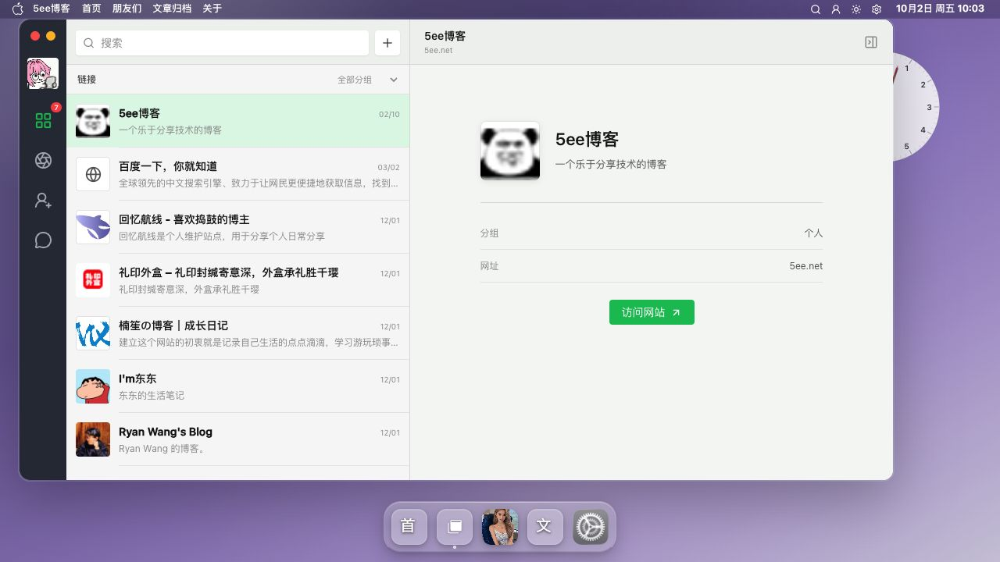](docs/功能/链接页/截图.md) | [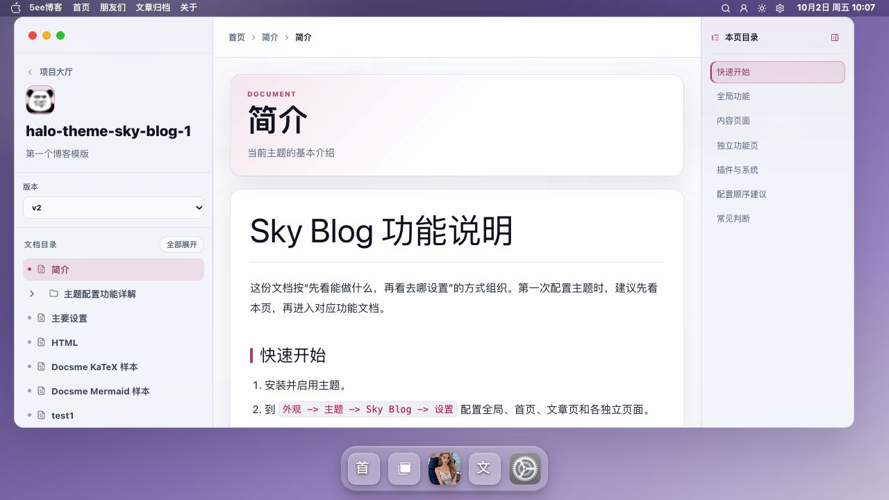](docs/功能/Docsme/截图.md) |
| [详细截图](docs/功能/首屏加载/截图.md) · [使用说明](docs/设置/前端系统设置.md#首屏加载) | [详细截图](docs/功能/链接页/截图.md) · [使用说明](docs/功能/链接页.md) | [详细截图](docs/功能/Docsme/截图.md) · [使用说明](docs/功能/Docsme.md) |
| **通知中心**：菜单栏入口与通知中心小组件。 | **朋友圈**：RSS 来源、公开动态与内容阅读。 | **手机布局**：正文聚焦、相册浏览与文档目录。 |
| [](docs/功能/通知中心/截图.md) | [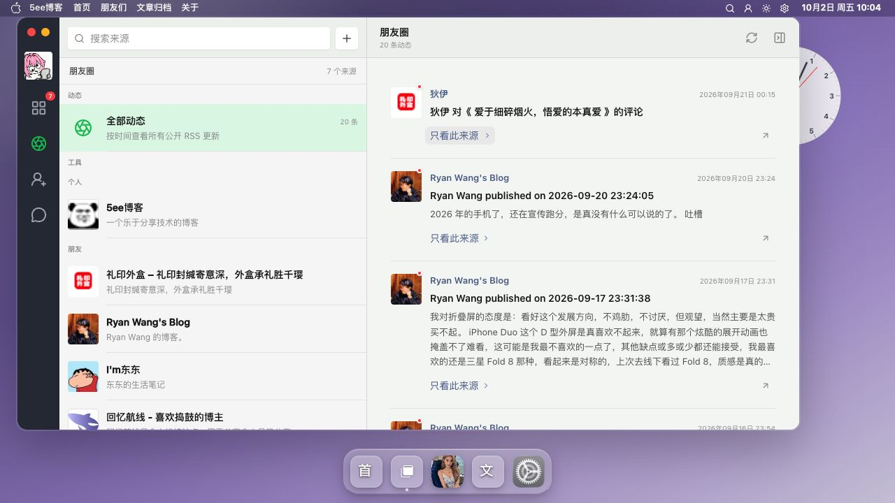](docs/功能/朋友圈/截图.md) | [](docs/功能/手机布局/截图.md) |
| [详细截图](docs/功能/通知中心/截图.md) · [使用说明](docs/功能/桌面壳层.md) | [详细截图](docs/功能/朋友圈/截图.md) · [使用说明](docs/功能/链接页.md) | [详细截图](docs/功能/手机布局/截图.md) · [使用说明](docs/功能/阅读页.md) |
| **全站搜索**：关键词查找与结果高亮。 | **登录**：锁屏式登录、第三方与 Passkey 入口。 | — |
| [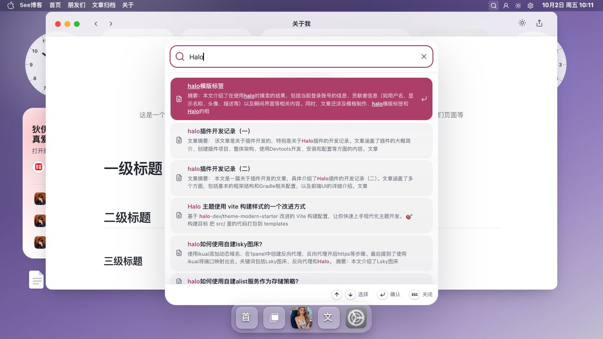](docs/功能/搜索/截图.md) | [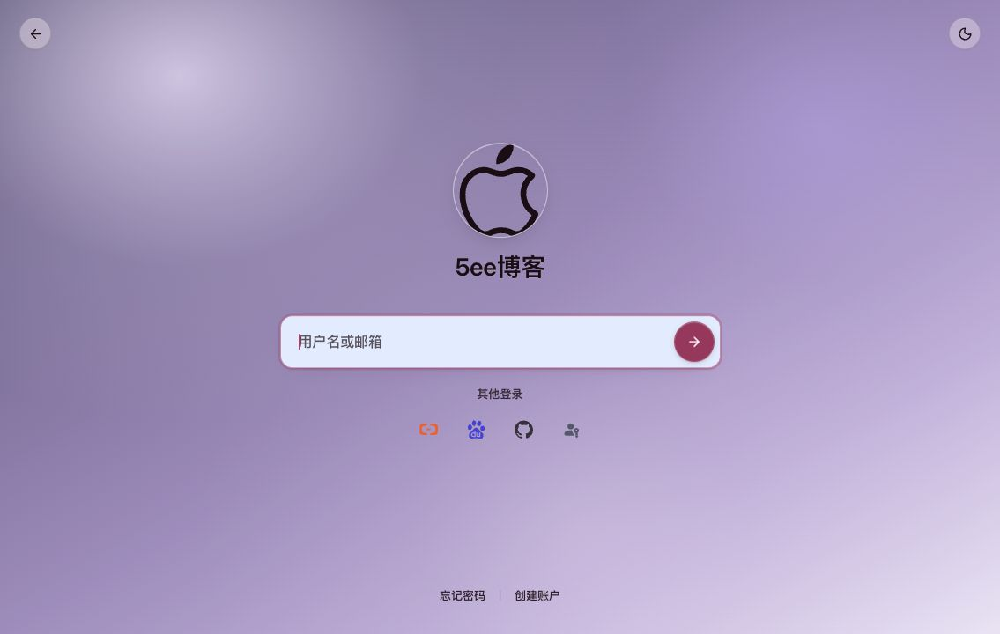](docs/功能/登录/截图.md) | — |
| [详细截图](docs/功能/搜索/截图.md) · [使用说明](docs/功能/桌面壳层.md) | [详细截图](docs/功能/登录/截图.md) · [使用说明](docs/功能/桌面壳层.md) | — |

更多界面状态按「截图 1、2、3…」收录在 [功能展示](docs/功能展示.md) 对应图集中；手机图片为浏览器窄屏预览。

## 安装与配置

1. 使用 Halo `>=2.26.0`，下载主题 ZIP，在后台「外观 → 主题」上传并启用。
2. 按 [后台配置指南](docs/设置/后台设置协助说明.md) 设置菜单、桌面入口和插件页面。
3. 登录具有主题配置权限的账号，从 Dock 或菜单栏打开「系统设置」，查看草稿效果后应用。素材选择与布局编辑见上方指南。

升级前备份主题配置和上一稳定 ZIP，完整步骤见 [发布与回滚](docs/发布与回滚.md)。

瞬间、图库、友链与朋友圈、追番、豆瓣、Steam、装备和 Docsme 等内容需要对应插件；搜索、评论和代码高亮也由相应插件提供。安装与更新前请查看 [插件适配状态](docs/插件适配状态.md) 与 [插件契约](docs/插件适配契约.md)。

## 文档入口

| 要了解什么 | 阅读入口 |
| --- | --- |
| 全部截图与功能操作 | [功能展示](docs/功能展示.md) · [文档索引](docs/文档索引.md) |
| 外观、墙纸、导航与首屏加载 | [前端系统设置](docs/设置/前端系统设置.md) |
| 图片、图标与桌面布局 | [素材选择](docs/设置/前端图片与图标设置.md) · [小组件指南](docs/桌面小组件.md) |
| Halo 应用市场介绍与精选素材 | [展示文案](docs/Halo应用市场展示文案.md) |
| 当前实现、验证范围与已知限制 | [项目进度](docs/项目进度.md) · [验证矩阵](docs/验证与审计矩阵.md) |
| 架构、开发约束与发布历史 | [架构总览](docs/架构总览.md) · [开发约束](docs/开发约束.md) · [发布说明](docs/发布说明.md) |

## 开发

Node `>=24.21.0 <25`，固定使用 pnpm `12.5.1`：

```bash
pnpm install --frozen-lockfile
pnpm run lint
pnpm run typecheck
pnpm run check
```

`check` 包含构建并改写 `templates/assets/**`；运行时变更需同步对应构建资源。其他命令、Halo 重载与浏览器验证要求见 [开发约束](docs/开发约束.md) 和 [验证矩阵](docs/验证与审计矩阵.md)。截图展示与真实配置保存、认证提交、真机验收分别记录。

## 反馈

- GitHub Issues：[提交问题或建议](https://github.com/sky121666/theme-sky-blog-3/issues)
- Release 下载：[版本发布页](https://github.com/sky121666/theme-sky-blog-3/releases)
- 加入社群：打开下方二维码，扫码交流使用问题和功能建议

| 企业微信（备注进群） | QQ 群 |
| :---: | :---: |
| [打开企业微信二维码](https://api.minio.yyds.pink/kunkunyu/files/2025/02/%E5%BE%AE%E4%BF%A1%E5%9B%BE%E7%89%87_20250212142105-pbceif.jpg) | [打开 QQ 群二维码](https://api.minio.yyds.pink/kunkunyu/files/2025/05/qq-708998089-iqowsh.webp) |

> 卖服务器的广告人，就不要加了。
