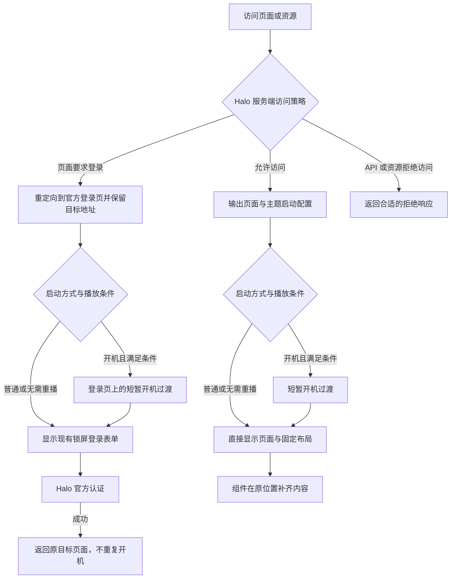

# 启动体验与全站登录保护设计

日期：2026-09-30

状态：已批准的冻结设计；主题启动体验已实施，进度与验收见[实施计划](../plans/2026-09-30-startup-experience.md)。服务端访问策略未变更。

适用：theme-sky-blog-3，当前源码版本 0.9.46，Halo 要求沿用 `>=2.26.0`。

## 1. 已确定的方向

默认采用**普通显示**：页面直接出现，墙纸、菜单栏、Dock 和桌面布局保持稳定，内容在原位置补齐。管理员可选**开机启动**，使用深色背景、苹果标识和细进度条，再进入桌面或登录界面。

主题控制启动表现；全站是否要求登录由 Halo 服务端控制。两项可以自由搭配，启用动画不改变访问权限，升级主题不改变已有的站点访问策略。

本设计覆盖后台主题设置、前端系统设置、桌面启动、登录返回、兼容和验收。下文保留设计阶段的目标与证据快照；实际实现、已验范围及未验事项以实施计划为准。

### 默认规则

| 项目 | 默认值与行为 |
| --- | --- |
| 启动方式 | 普通显示，不播放全屏开机动画 |
| 开机动画频率 | 选用开机模式后，每个标签页首次进入播放一次 |
| 动画标识 | 苹果标识，可改为站点标识或自定义图片 |
| 访问策略 | 新站点由 Halo 原有默认策略决定；现有站点保留当前策略 |
| 登录界面 | 继续使用主题现有 macOS 锁屏风格及 Halo 官方认证表单 |
| 减少动态效果 | 跟随系统；开启时直接显示可用页面 |
| 不支持或读取失败 | 启动表现降级为普通显示；访问策略仍由服务端执行 |

## 2. 现有基础与证据边界

本节为本轮只读核验的结果。后续章节描述目标设计，不代表已经实现或验收。

| 已核验事实 | 对设计的影响 |
| --- | --- |
| `settings.yaml` 是持久化主题配置来源，前端字段注册表有对应一致性校验 | 启动字段进入同一份配置，后台和前端共用保存链路 |
| 当前登录页已有墙纸、站点标识、用户名输入和认证方式选择 | 复用现有登录界面，保留 Halo 表单和认证流程 |
| 首页刷新时，墙纸和菜单栏先出现，桌面节点稍后集中出现；普通刷新仍能观察到内容空档 | 优先解决布局占位与接管时序，再增加可选开机效果 |
| 首页已有服务端布局 JSON，运行时会解析并计算网格 | 早期占位与运行时采用相同的布局投影规则 |
| Shell 和 Auth 有独立入口，PJAX 有独立导航生命周期 | 共用启动规则，分别接入桌面和登录场景 |
| 当前本地容器镜像为 `registry.fit2cloud.com/halo/halo-pro:2.26.1` | 可优先核验官方私密能力；镜像本身不证明许可证有效或保护已启用 |

尚未核验：Pro 许可证有效性、当前私密设置、可读取或修改私密策略的官方接口，以及 HTML、API、附件和插件路由的实际保护范围。

Halo 官方版本对比列出 Pro／商业版支持全站登录后访问；Pro 2.23.0 发布说明提到全站私密和附件资源拦截。因此采用官方能力作为首选服务端方案，但实际环境仍需按第 13 节验证。

社区版的两种启动表现均可实现。需要全站登录保护时，应另接服务端能力。已审查的第三方“全局私密”1.0.9 插件会放行 `/api`、`/apis` 和常见静态资源扩展名，不能单凭该插件宣称内容、API 和附件均已私密。

## 3. 方案选择

| 方案 | 结果 | 结论 |
| --- | --- | --- |
| 主题统一启动配置，服务端使用官方私密能力 | 配置清楚，可保留现有认证、布局及导航链路 | **采用** |
| 主题自行判断登录状态并遮挡页面 | 无法阻止绕过页面读取 API、附件或缓存内容 | 不采用 |
| 新建独立启动应用和自定义登录系统 | 增加入口、资源和认证维护成本，难以保持既有协议 | 不采用 |

社区版的服务端保护插件作为独立适配范围，需验证完整保护边界后再接入。本次设计不新增认证系统或安全插件。

## 4. 整体链路



启用全站登录保护后，匿名访问先由服务端跳转到 `/login`。开机模式在登录页显示过渡，随后出现锁屏登录表单；登录成功后返回原页面。首页目标返回桌面，文章等深链接返回对应页面。

已有有效登录会话时直接进入目标页面，启动方式仍遵守播放频率。认证失败留在官方表单；会话失效时重新进入登录链路。

| 启动方式 | 服务端公开访问 | 服务端要求登录，匿名访问 |
| --- | --- | --- |
| 普通显示 | 直接进入桌面或目标页面 | 直接显示锁屏登录页，成功后返回目标 |
| 开机启动 | 开机过渡后进入桌面或目标页面 | 开机过渡后显示锁屏登录页，成功后返回目标 |

## 5. 后台主题设置

在 `settings.yaml` 的现有“桌面”分组内新增“启动体验”子组。后台用于设置站点默认表现，不增加第二套持久化配置。

以下路径、枚举和默认值是**待实现的字段设计**：

| 路径 | 类型与取值 | 默认值 | 显示条件 |
| --- | --- | --- | --- |
| `desktop.startup.mode` | `direct` 普通显示／`boot` 开机启动 | `direct` | 始终 |
| `desktop.startup.frequency` | `tab_once` 每个标签页首次／`every_reload` 首次及每次主动刷新 | `tab_once` | 开机模式 |
| `desktop.startup.logo_mode` | `apple` 苹果标识／`site` 站点标识／`custom` 自定义 | `apple` | 开机模式 |
| `desktop.startup.logo_url` | 图片地址，沿用现有资源选择和图片校验能力 | 空 | 开机模式且选择自定义 |

规则：

- 普通模式不请求开机模块或自定义开机图片。
- 未知模式取普通显示；未知频率按每标签页首次处理。
- 自定义图片加载失败使用内置标识，不阻塞页面。新增图片支持范围必须与现有前端、后台校验一致。
- 切换启动方式保留其他字段，便于再次启用。隐藏字段不触发当前无关校验错误。
- 后台保存后在下一次符合条件的完整页面访问生效。
- 不新增“强制登录”主题布尔字段。访问策略进入 Halo 对应的服务端设置链路。

## 6. 前端系统设置

在现有系统设置的系统分类增加“启动与登录”，使用现有浅色层级、侧栏、搜索、草稿和底部“取消／应用”按钮。

```text
启动与登录

启动方式
  ● 普通显示       页面直接出现，内容在原位置补齐
  ○ 开机启动       显示苹果标识和启动过渡

选用开机模式后：
  播放频率        每个标签页首次 ▾
  启动标识        苹果标识 ▾
  自定义图片      [选择图片]        仅自定义时显示
  [演示一次]

站点访问
  当前策略        未核验／公开访问／需要登录
  [打开 Halo 后台]

                         [取消] [应用]
```

### 草稿、保存与演示

选择开机模式只更新草稿，不立即遮住当前桌面。“演示一次”使用当前有效草稿展示动效，可点击跳过或按 Escape 结束；演示不保存配置，也不写入首次播放记录。结束后恢复焦点和原有设置窗口，草稿保持原样。

“应用”沿用现有配置读取、ETag／If-Match、CSRF、脏字段合并和冲突处理。启动设置提示下一次完整访问生效；取消还原草稿。前端和后台同时修改时，不覆盖未经本次修改的配置。

站点级配置沿用现有配置读取和写入权限，登录本身不代表可修改。普通访客不新增写入能力。

### 站点访问状态

仅在可信服务端证据足够时显示“公开访问”或“需要登录”。没有可靠接口、没有读取权限、能力未知或状态过期时显示“未核验”，并提供已知的 `/console` 后台入口。

本阶段不假设 Pro 存在可直接调用的私密配置接口，不提供主题内的策略切换按钮。先核实官方接口、权限、并发保存与恢复办法，再设计直接控制服务端策略的交互。动画功能不依赖这一步。

## 7. 普通显示的首屏规则

普通显示承担日常使用体验，优先消除目前“空桌面后集中出现”的过程。

1. 首次绘制先呈现墙纸、菜单栏和 Dock 的稳定结构。图片未完成时保留图标尺寸及可识别的回退标识。
2. 依据已有服务端布局 JSON，尽早显示当前可见桌面图标和小组件的对应占位。
3. 运行时接管相同标识、位置和尺寸，内容在原位置替换，不重复清空和重新排布整层桌面。
4. 天气、头像、封面等继续异步加载。成功、空数据和失败均在各自组件内处理。

早期占位必须复用运行时的响应式网格、左右锚点、碰撞和隐藏规则。设计上只抽取必要的纯布局投影能力，不维护两套坐标算法，不把临时视口计算结果写回用户布局。

内容替换可使用约 120–180 ms 的轻微透明度过渡，先在首页样板验证。刷新保持同一布局；不加入整屏缩放、逐个飞入或重复开场。这些时长为设计起始值，不是 Apple 官方规定。

## 8. 开机模式的视觉和交互

### 视觉基准

| 元素 | 设计起始值 |
| --- | --- |
| 背景 | 深色纯背景，建议 `#080808` |
| 标识 | 桌面约 88 px，窄屏约 72 px，保持比例 |
| 进度条 | 宽约 160 px、高约 3 px，圆角、弱对比轨道 |
| 标识与进度条间距 | 约 28 px，整体居中并适配安全区域 |
| 进入／退出 | 约 120 ms／180 ms 的轻微淡入淡出 |
| 正常结束 | 当前场景达到可交互条件后退出，无人为最低等待时间 |
| 最长遮挡 | 从启动层激活起最多 2 秒；超时退出并显示页面真实状态 |

快速加载不为完整播放动画额外等待。桌面未完全拿到异步数据也可进入；开机层结束不代表所有图片、小组件或网络请求已完成。

进度仅映射已完成的结构和交互阶段，不显示虚构百分比。当前阶段耗时不可预测时使用不确定进度表现；失败或超时直接退出，不把进度补满后宣称加载成功。

### 退出和可访问性

- 提供“跳过”按钮和 Escape，手机触控目标至少 44 px。
- 尊重 `prefers-reduced-motion`，直接显示页面。
- 仅启动层实际激活时临时管理焦点，并在退出时恢复到合理目标；不能丢失已经输入的内容。
- 用户已开始操作后，不补播迟到的开机层。认证错误和资源恢复提示应保持可见。
- 禁用 JavaScript、模块失败或异常退出时，启动层不能持续遮挡表单或恢复入口。
- 保证取消、超时和异常路径都释放临时焦点及交互锁定，不遗留 `inert` 或滚动锁。

## 9. 播放频率与返回行为

播放记录仅表示视觉体验，每个标签页独立。它不存储认证状态、访问权限或受保护内容。

| 导航场景 | `tab_once` | `every_reload` |
| --- | --- | --- |
| 标签页首次进入支持场景 | 播放 | 播放 |
| 同标签页主动刷新 | 已播放则跳过 | 播放 |
| 登录成功返回目标页 | 跳过重复播放 | 跳过重复播放 |
| 登录方式切换、认证回调或失败重试 | 跳过重复播放 | 跳过重复播放 |
| PJAX 页内导航 | 不播放 | 不播放 |
| 浏览器后退／前进、BFCache 恢复 | 不播放 | 不播放 |
| 资源恢复机制触发的自动重载 | 不循环播放 | 不循环播放 |
| “演示一次” | 不读写播放记录 | 不读写播放记录 |

实现时采用导航类型与最小视觉记录共同判断，不能仅用“URL 是否为首页”。进入开机流程即记录本次尝试，跳过或失败也视为尝试过，以免登录返回和恢复重载循环播放。存储不可用时采用普通显示。

浏览器的 `reload` 类型不能区分用户刷新与主题自动恢复。主题自身的恢复重载须在调用 reload 前写入一次性、短寿命的视觉标记，由下一文档消费后清除；该机制为待实现设计。标记应限制到对应站内目标，避免跳过无关导航。用户点击“修复／重试”触发的恢复重载同样跳过；浏览器刷新及系统设置“刷新页面”按主动刷新处理。无法可靠写入或读取恢复标记时采用普通显示。

登录返回衔接需要明确的视觉去重机制；不得扩展官方认证参数或信任客户端标记判断身份。跨标签页打开新目标按新标签页规则处理。

## 10. 前端接入与就绪定义

### 分层职责

| 层 | 职责 |
| --- | --- |
| Halo 服务端 | 访问控制、官方登录、回跳校验、受保护响应与缓存策略 |
| 主题模板 | 输出启动配置、基础结构、当前场景及已有布局数据 |
| 共用启动模块 | 判断频率、管理短暂视觉层、处理跳过和异常退出 |
| Desktop Shell | 报告当前页面基础结构和交互是否可用，保持布局稳定 |
| Auth | 报告当前登录表单可用，保留原有认证与焦点流程 |
| 小组件和应用 | 自行加载数据，提供局部加载、空状态、错误和重试 |

共用启动模块按需接入 Shell 与 Auth，不新建应用路由。普通模式不增加可选模块请求；开机模式的最小首屏结构及样式按配置输出，后续模块与现有 manifest、构建标识和资源恢复机制一致。

早期播放判断和退出保护必须在视觉层可能遮挡页面前就绪。模块迟到或版本不匹配时放弃播放。设独立的有限时长退出保护，避免只有业务模块成功执行才能移除开机层。

### 新增的内部就绪状态

以下为待实现的内部合同，不是当前已有 API：

- `document-ready`：模板及启动配置可读取。
- `interactive`：当前场景的基础结构和必要交互可用，允许结束开机层。
- `failed`：启动链路失败，立即撤掉视觉层，让真实错误或恢复提示可见。

桌面首页的 `interactive` 至少要求：网格已按当前视口计算、期望可见节点与占位对齐、菜单栏及 Dock 基础交互可用。通用应用页要求 SSR 根节点存在、本地 hydrate 已完成必要控制的绑定，不等待异步应用数据；局部加载状态继续保留。不能可靠声明该状态的页面按 2 秒上限退出，不制造完成进度。登录页要求官方表单与已启用认证方式的必要交互可用。

不能直接把现有 bootstrap Promise 结束、Alpine 启动标记、Dock `data-ready` 或“存在任意桌面节点”当作完成信号：它们分别只证明部分阶段，bootstrap 的错误恢复路径也可能结束 Promise。

当前 `activateCurrentPageApp` 调用 hydrate 本身也不证明异步数据已就绪。接入时需报告上述本地交互条件，不能据此声称整页数据加载完成。

新信号一次性、可取消且区分失败。页面替换、重复初始化或过期事件不得重新盖住当前页面。PJAX 导航完成仅用于导航自身，不触发开机播放。

## 11. 全站登录保护与登录适配

### 服务端执行要求

以下是验收要求，尚未证明当前 Pro 环境全部满足：

- 匿名页面访问进入官方登录页，保留经服务端校验的站内目标地址。
- 未认证的内容 API 返回 401；已认证但无权限返回 403。拒绝响应不包含受保护内容。
- 私有附件、缩略图、搜索数据、插件接口和插件页面不泄露受保护内容。
- 访问检查发生在受保护内容返回之前，缓存不得跨匿名和不同用户复用私有响应。
- 只放行当前认证流程需要的登录、验证码、身份提供者回调等资源；不能整体放行全部 API。

API 状态码、页面重定向的内容协商行为和附件保护覆盖范围，均需真实请求验证。若官方 Pro 的实际 API 响应不符合上述目标，应记录未达标并评估兼容适配；不能以 302 登录页或其他状态代替 API 401／403 验收。

### 官方认证保持完整

复用现有 `.halo-form`、用户名／密码流程、记住登录、验证码、Passkey、身份提供者和密码重置入口。主题只改变启动表现，不拦截凭证提交或自建用户会话。

注册、密码重置等可见性遵守 Halo 实际启用配置。认证回调、验证码和中间挑战页面不播放开机层；控制台、用户中心、错误和初始化页面不纳入该启动体验。

匿名登录页使用公开的装饰资源。自定义开机标识若指向受保护附件，不能通过放行私有附件来保证显示，应使用内置回退标识。

### 会话失效与导航

PJAX 收到要求登录的响应或登录页重定向时，交给完整页面导航，避免把登录 HTML 插入桌面内容区。尊重原有未保存内容处理，不无限重试，也不自动重复播放开机层。

退出登录和 BFCache 恢复时需检查当前访问状态，清除主题维护的私有数据缓存并避免继续展示已失效会话的数据。仅靠前端无法承诺瞬间清除浏览器已保存的旧画面；服务端不返回未授权内容和前端恢复行为应分别验收。

## 12. 兼容、降级与性能

| 场景 | 设计要求 |
| --- | --- |
| Halo 社区版 | 普通／开机两种表现可用；全站保护需单独验证服务端能力 |
| Pro 未激活或状态未知 | 动画照常可选；访问状态显示未核验，保持实际服务端策略 |
| Pro 已激活且私密已验证 | 采用官方保护链路，主题展示对应可信状态 |
| 现有已私密站点升级主题 | 保留服务端策略，不能因主题默认普通而取消登录保护 |
| 插件采用桌面页面布局 | 沿用页面协议，完整首次访问可播放，PJAX 切换不重播 |
| 插件采用普通页面布局 | 保持该布局；启动能力缺失时直接显示，不强制套桌面 |
| 移动端和窗口改变尺寸 | 同一布局投影适配，标识与跳过入口避开安全区 |
| 低性能、慢网、资源失败 | 不等待非关键数据，最多 2 秒退出视觉层，保留真实恢复入口 |
| JavaScript 被禁用 | 不额外遮挡既有服务端内容、原生表单或恢复提示；不承诺现有桌面全部功能可无 JS 使用 |

性能约束：不新增框架，不为普通模式下载动画依赖，不预加载全部墙纸或小组件。优先复用配置和首屏结构，减少桌面整层显隐。自定义标识按需请求，图片失败不扩散成启动失败。

Apple 的 Loading、Motion 和 Progress indicators 指南作为设计原则参考；本设计的具体尺寸、时长和频率是本主题的候选标准，需在真实页面验证后定稿。

## 13. 验收矩阵

实现验收按下表执行；本次仅交付设计，没有执行产品修改后的测试。

| 范围 | 通过条件 |
| --- | --- |
| 默认与升级 | 缺少新字段时普通显示；既有访问策略和布局保持；普通模式不请求开机模块 |
| 配置一致性 | 后台与前端读写同一字段；取消、冲突、失败、权限不足均准确处理；应用后刷新值一致 |
| 普通首屏 | 首次与刷新均保留稳定壳层；可见图标和组件占位与最终几何一致，无整层重新出现 |
| 开机首屏 | 标识、进度和淡出符合设计；快速页面不强制等待；完成信号只代表必要交互 |
| 播放条件 | 两种频率、登录返回、PJAX、BFCache、认证切换、自动恢复和演示逐项符合第 9 节 |
| 可访问性 | 减少动态效果、键盘跳过、触控跳过、焦点恢复及无障碍名称可用 |
| 失败与慢网 | 模块、标识、CSS 或认证交互失败均可退出；2 秒上限有效，不留遮挡或交互锁 |
| 登录兼容 | 实际启用的密码、验证码、Passkey、第三方身份提供者分别验证；输入和错误信息不丢失 |
| 服务端私密 | 匿名 HTML、内容／搜索 API、代表性插件 API 和页面、私有附件直链及缩略图均不返回私密内容；API 符合 401／403 目标 |
| 缓存与会话 | 登录、退出、会话到期、两用户、缓存代理和 BFCache 恢复分别验证，不串用私有数据 |
| 布局与尺寸 | 320／375 px 窄屏及代表性桌面宽度、首页和代表性插件布局验证，无新增溢出或错位 |
| 仓库门禁 | 按实际改动运行相关契约检查和 `pnpm run check`；模板／YAML 改动执行重载；交互改动继续执行页面冒烟 |

私密验收需准备受控测试账号、私有内容和代表性资源，具体测试操作在实施阶段核对授权。仅页面跳到登录不构成全站保护通过。

## 14. 实施边界与推进顺序

设计审阅通过后再编写实施计划，顺序如下：

1. **普通显示基础**：统一布局投影和占位接管，明确各场景就绪状态。
2. **启动设置与开机表现**：后台字段、前端设置、按需模块、频率、演示和降级。
3. **登录与导航衔接**：接入独立 Auth 入口，验证官方认证、目标返回及播放去重。
4. **服务端私密适配与验收**：先核验许可证、现有策略、官方能力和请求覆盖；有依据后接状态展示。直接切换服务端策略另行确认真实接口和权限。

前三项的设计无需等待私密接口核验。第四项不能通过主题布尔字段代替，也不自动授权改变现有站点访问策略。

恢复方案：启动字段改回普通显示；可选模块失败自动普通显示；模板和前端接入可回退对应改动。服务端访问策略单独恢复，不随动画设置联动。真实服务端变更前另行说明主要影响、验证与恢复方式。

## 15. 代码入口与来源

### 已核验的项目入口

- 后台配置：[settings.yaml](../../../settings.yaml)。
- 前端字段注册：[settings-model/schema.js](../../../src/shell/desktop-shell/runtime/desktop/settings-model/schema.js)。
- 系统设置模板与保存：[theme-settings.html](../../../templates/modules/shell/theme-settings.html)、[theme-settings.js](../../../src/shell/desktop-shell/runtime/desktop/theme-settings.js)。
- 配置读写客户端：[theme-config-client.js](../../../src/shell/desktop-shell/runtime/shared/theme-config-client.js)。
- Shell 引导：[layout.html](../../../templates/modules/shell/layout.html)、[entry-main.js](../../../src/shell/desktop-shell/entry-main.js)。
- 桌面布局：[desktop-widgets.html](../../../templates/modules/shell/desktop-widgets.html)、[surface/index.js](../../../src/shell/desktop-shell/runtime/desktop/surface/index.js)、[surface/grid.js](../../../src/shell/desktop-shell/runtime/desktop/surface/grid.js)。
- Auth 入口及模板：[auth/entry.js](../../../src/apps/auth/entry.js)、[auth/hydrate.js](../../../src/apps/auth/hydrate.js)、[gateway layout](../../../templates/gateway_fragments/layout.html)、[gateway login](../../../templates/gateway_fragments/login.html)。
- 导航协议：[主题导航契约](../../主题导航契约.md)、[PJAX runtime](../../../src/shell/desktop-shell/runtime/desktop/pjax/index.js)。

### 官方与上游来源

- [Halo 官方版本对比](https://www.halo.run/archives/halo-editions-comparison)：全站登录访问的版本能力。
- [Halo Pro 2.23.0 发布说明](https://releases.halo.run/releases/halo-pro/v2.23.0)：全站私密和附件资源拦截。
- [Halo 商业版本激活指南](https://docs.halo.run/guide/use/activate)：版本与许可证核验。
- [Halo 2.26.1 服务端授权配置](https://github.com/halo-dev/halo/blob/v2.26.1/application/src/main/java/run/halo/app/security/authorization/AuthorizationExchangeConfigurers.java)：现有官方授权入口。
- [第三方全局私密访问策略源码](https://github.com/Frost-leafleaf/global-private/blob/4f9a8204761413decf5ad08b9a85610c74774ea8/src/main/java/com/codex/privateloginguard/PrivateLoginGuardAccessPolicy.java)：本次审查的放行范围，不能作为完整私密保护承诺。
- [Apple Loading](https://developer.apple.com/design/human-interface-guidelines/loading)、[Motion](https://developer.apple.com/design/human-interface-guidelines/motion)、[Progress indicators](https://developer.apple.com/design/human-interface-guidelines/progress-indicators)：尽早显示内容、动效简短明确、进度真实。
