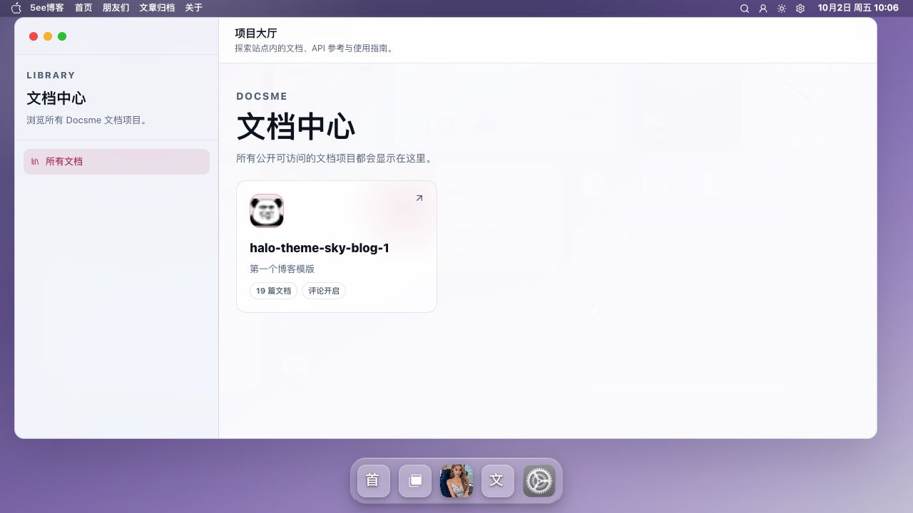
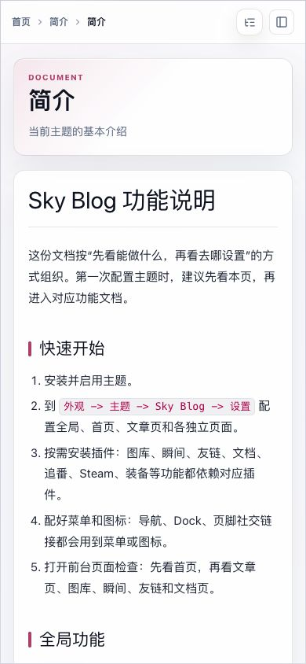
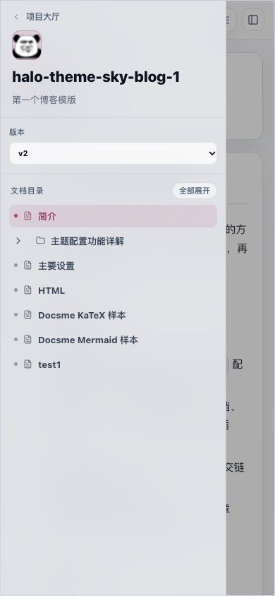

# Docsme 截图

Docsme 提供项目大厅、文档树和正文阅读界面，便于浏览站点文档。

[返回 README](../../../README.md) · [使用指南](../Docsme.md) · [全部功能](../../功能展示.md)

截图采集于 **2026-10-02**，主题为 **v0.9.47**；桌面图来自 **1280×720 或 1135×720 浏览器窗口**，手机图来自 **390×844 浏览器窄屏预览**。图集记录页面展示，权限、语言、版本及交互验收范围见使用指南；真机体验仍需独立验收。

[截图 1](#截图-1) · [截图 2](#截图-2) · [截图 3](#截图-3) · [截图 4](#截图-4)

## 截图 1

**项目大厅**：文档项目的浏览入口。

## 截图 2

**文档阅读**：文档树、正文与页内目录。

## 截图 3

**手机文档正文**：390×844 浏览器窄屏中的正文预览。

## 截图 4

**手机文档目录**：390×844 浏览器窄屏中的文档目录抽屉。

