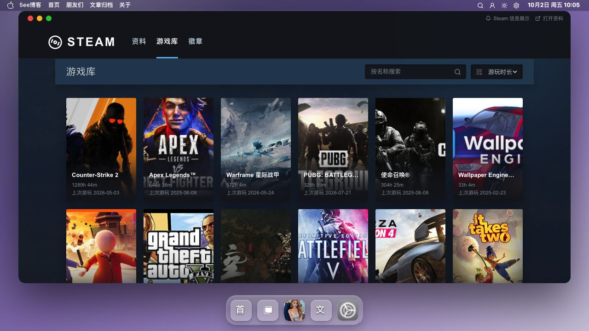
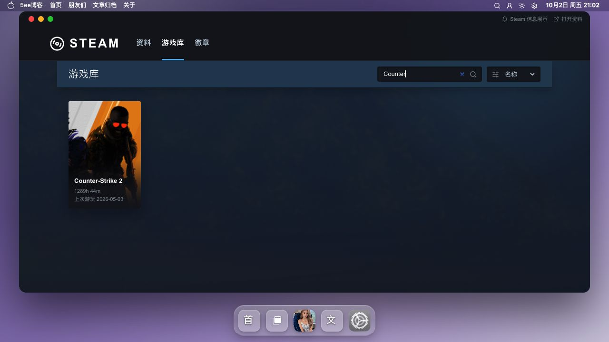

# Steam 截图

Steam 应用用于浏览游戏库，提供当前页搜索和本地排序入口。

[返回 README](../../../README.md) · [使用指南](../Steam.md) · [全部功能](../../功能展示.md)

截图采集于 **2026-10-02**，主题为 **v0.9.47**；仅记录前台展示，插件同步、跨页数据与真机验收以使用指南为准。

## 截图目录

- [截图 1：游戏库](#截图-1)
- [截图 2：关键词筛选](#截图-2)

## 截图 1

**游戏库**

游戏库展示已加载的游戏条目，工具栏提供搜索和排序入口。

## 截图 2

**关键词筛选**

输入「Counter」后，游戏库只显示 Counter-Strike 2 一条结果，排序控件选择「名称」。

