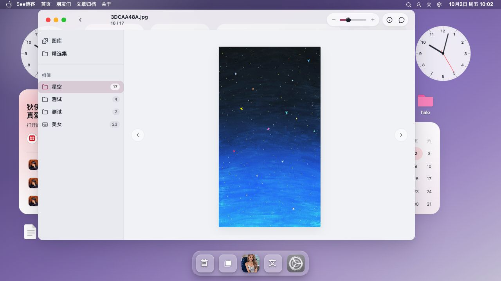

# 图库截图

图库通过相册和瀑布流组织照片，并提供图片详情与浏览控件。

[返回 README](../../../README.md) · [使用指南](../图库.md) · [全部功能](../../功能展示.md)

截图采集于 **2026-10-02**，主题为 **v0.9.47**；桌面图来自 **1280×720 或 1135×720 浏览器窗口**，手机图来自 **390×844 浏览器窄屏预览**。图集记录页面展示，交互与写入验收范围见使用指南；真机体验仍需独立验收。

[截图 1](#截图-1) · [截图 2](#截图-2) · [截图 3](#截图-3)

## 截图 1

**相册与瀑布流**：相册侧栏和照片瀑布流。

## 截图 2

**图片详情**：图片详情与浏览控件。

## 截图 3

**手机图库**：390×844 浏览器窄屏中的相册与瀑布流预览。

