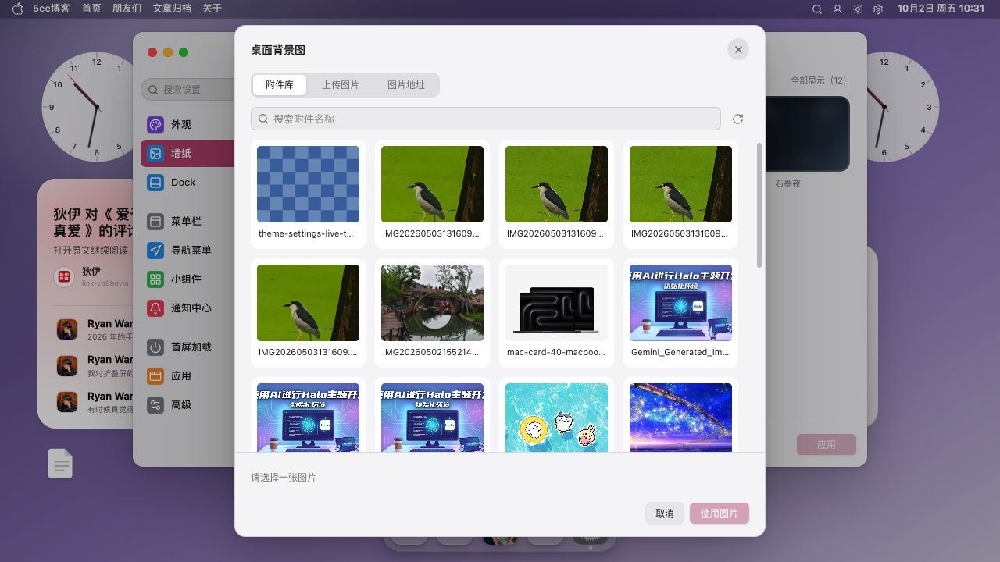
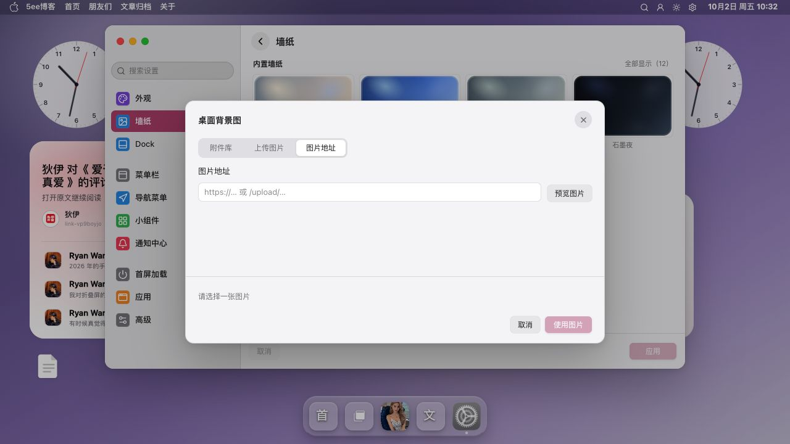

# 图片与图标截图

图片与图标选择器用于浏览 Halo 附件、输入图片地址和查找 Iconify 图标。

[返回 README](../../../README.md) · [使用指南](../../设置/前端图片与图标设置.md) · [全部功能](../../功能展示.md)

截图采集于 **2026-10-02**，主题为 **v0.9.47**；桌面图来自 **1280×720 或 1135×720 浏览器窗口**。采集只打开面板及浏览分类，素材选用、上传、配置应用与持久化仍需独立验收。

[截图 1](#截图-1) · [截图 2](#截图-2) · [截图 3](#截图-3)

## 截图 1

**Halo 附件库**：图片选择器中的附件浏览界面。

## 截图 2

**图片地址**：通过图片地址提供素材的输入入口。

## 截图 3

**Iconify 图标选择器**：图标分类与结果网格。

