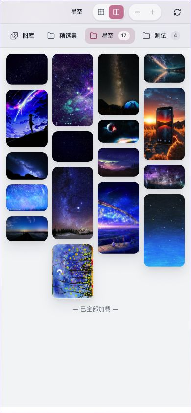

# 手机布局截图

窄屏布局覆盖文章阅读、图库和文档浏览，让主要内容在较小视口中保持清晰。

[返回 README](../../../README.md) · [阅读使用指南](../阅读页.md) · [全部功能](../../功能展示.md)

截图采集于 **2026-10-02**，主题为 **v0.9.47**，使用浏览器 **390×844** 窄屏视口；这些截图不构成真机或触摸验收。

## 截图目录

- [截图 1：窄屏文章阅读](#截图-1)
- [截图 2：窄屏图库](#截图-2)
- [截图 3：窄屏文档阅读](#截图-3)
- [截图 4：窄屏文档目录](#截图-4)

## 截图 1

**窄屏文章阅读**

文章内容适配窄屏视口，保留阅读页面的标题与正文层次。

## 截图 2

**窄屏图库**

图库在窄屏视口中展示分类与图片内容。

## 截图 3

**窄屏文档阅读**

文档正文适配窄屏内容区域，便于继续阅读。

## 截图 4

**窄屏文档目录**

展开文档目录后，可在窄屏视口中查看文档树。

