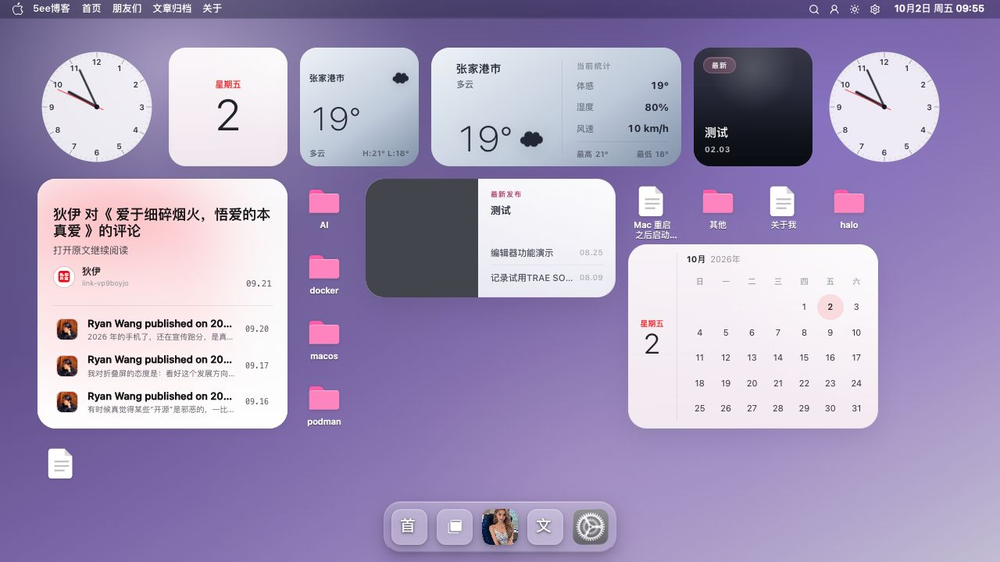

# 桌面壳层截图

桌面壳层提供主题桌面、窗口和 Dock，承接各功能的打开与切换。

[返回 README](../../../README.md) · [使用指南](../桌面壳层.md) · [全部功能](../../功能展示.md)

截图采集于 **2026-10-02**，主题为 **v0.9.47**；桌面图来自 **1280×720 或 1135×720 浏览器窗口**。图集记录界面展示，交互、认证与写入验收范围见使用指南。

[截图 1](#截图-1) · [截图 2](#截图-2)

## 截图 1

**桌面与小组件**：桌面背景、小组件、顶栏和 Dock 的整体界面。

## 截图 2

**窗口最小化**：窗口最小化后在 Dock 中的展示状态。

