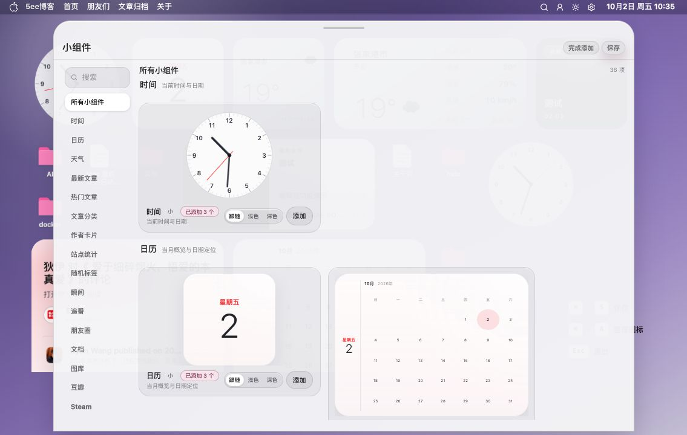
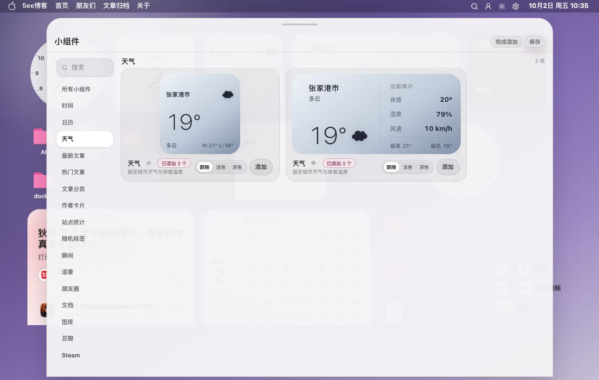
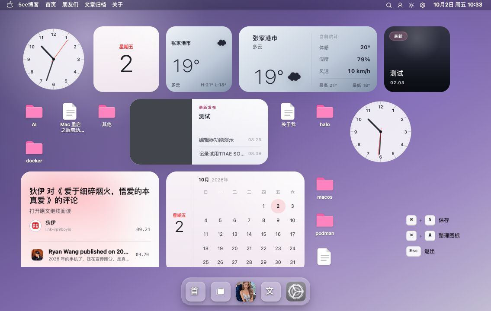
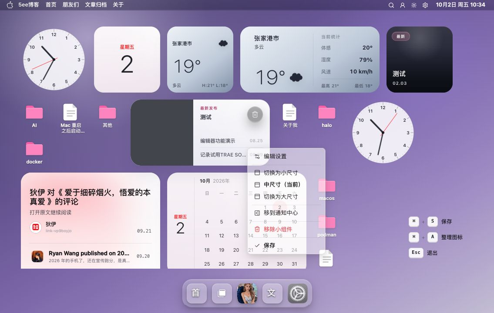

# 桌面小组件截图

桌面小组件提供组件预览、布局编辑和右键菜单，方便管理员组织桌面内容。

[返回 README](../../../README.md) · [使用指南](../../桌面小组件.md) · [全部功能](../../功能展示.md)

截图采集于 **2026-10-02**，主题为 **v0.9.47**；桌面图来自 **1280×720 或 1135×720 浏览器窗口**。采集只打开管理员会话中的编辑器、右键菜单和组件中心，并切换组件分类；布局调整、组件添加与保存结果仍需独立验收。

[截图 1](#截图-1) · [截图 2](#截图-2) · [截图 3](#截图-3) · [截图 4](#截图-4)

## 截图 1

**组件中心**：组件分类与组件预览。

## 截图 2

**天气组件分类**：天气组件的不同尺寸预览。

## 截图 3

**桌面布局编辑态**：布局编辑界面与快捷键提示。

## 截图 4

**小组件右键菜单**：右键菜单中的尺寸等操作选项。

