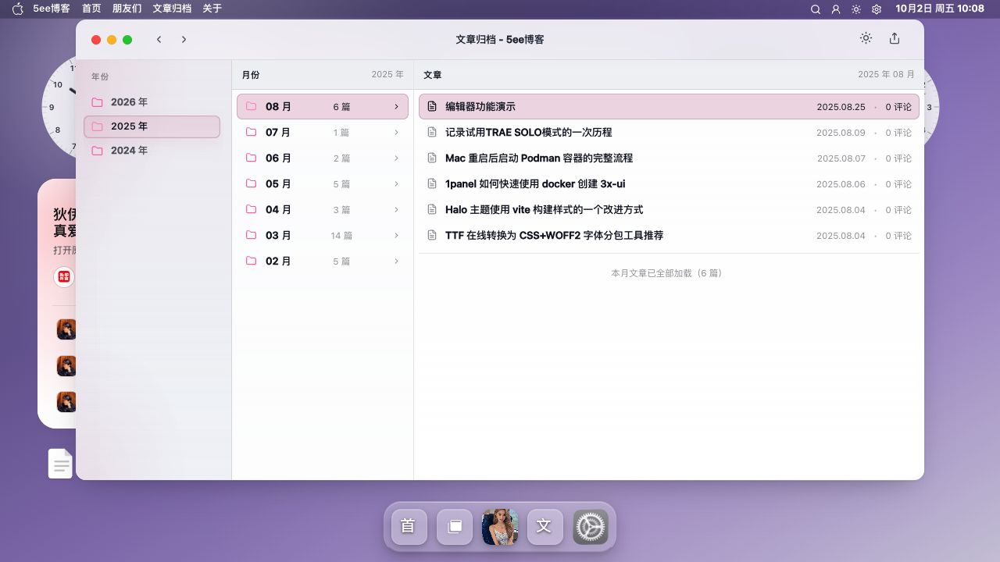
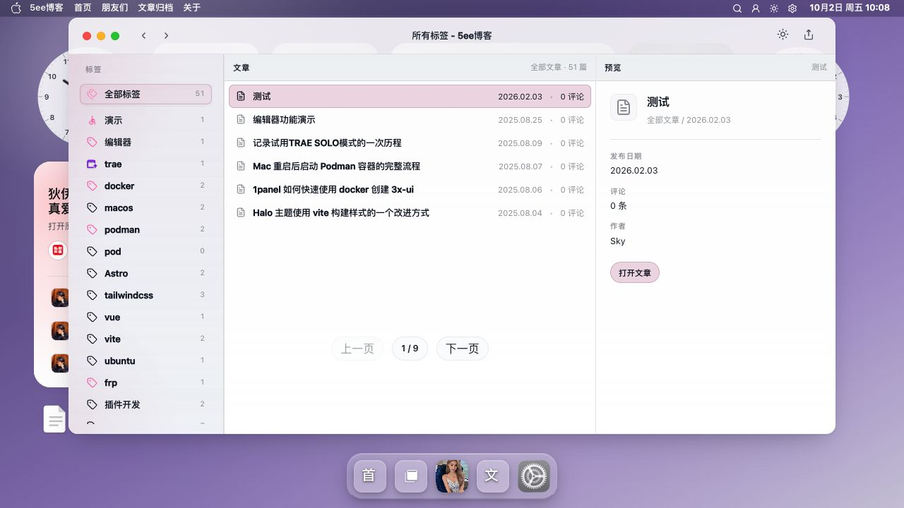
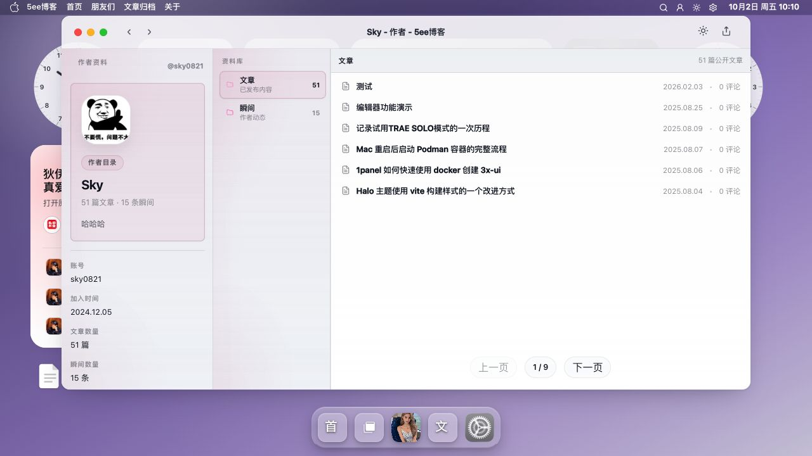

# 浏览列表截图

浏览列表通过分类、归档、标签和作者入口组织文章，帮助访客找到要阅读的内容。

[返回 README](../../../README.md) · [使用指南](../浏览列表.md) · [全部功能](../../功能展示.md)

截图采集于 **2026-10-02**，主题为 **v0.9.47**；桌面图来自 **1280×720 或 1135×720 浏览器窗口**。图集记录页面展示，交互与写入验收范围见使用指南。

[截图 1](#截图-1) · [截图 2](#截图-2) · [截图 3](#截图-3) · [截图 4](#截图-4)

## 截图 1

**分类 Finder**：分类导航与文章预览。

## 截图 2

**文章归档**：按年份与月份浏览文章。

## 截图 3

**标签浏览**：标签列表与文章预览。

## 截图 4

**作者主页**：作者资料与文章列表。

