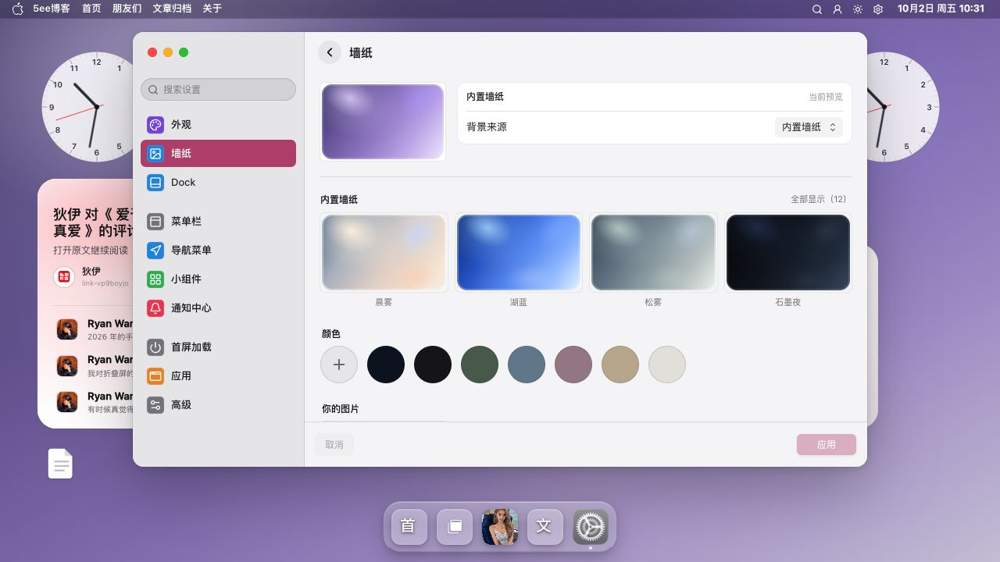
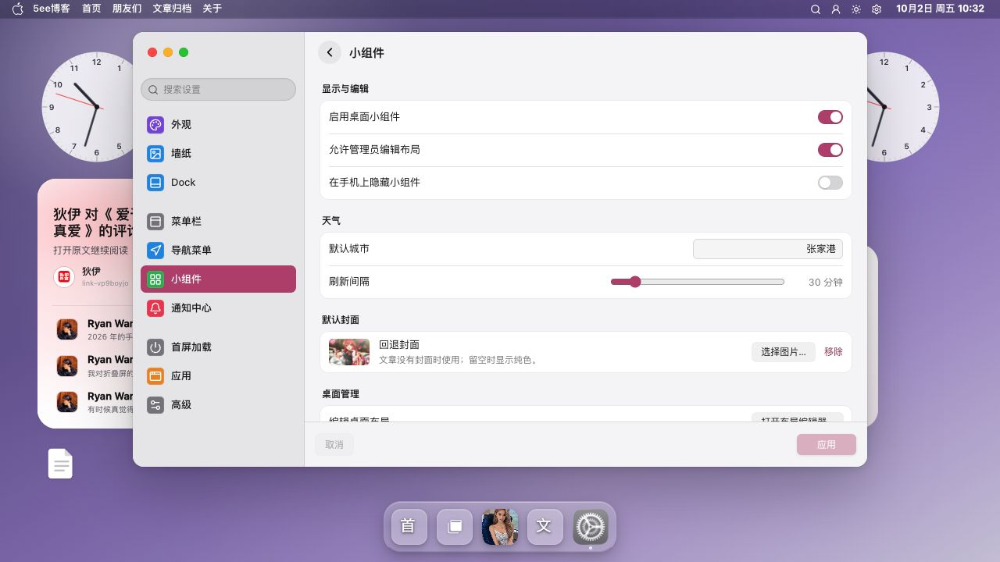

# 系统设置截图

系统设置集中提供主题外观、墙纸、首屏加载和小组件的配置入口。

[返回 README](../../../README.md) · [使用指南](../../设置/前端系统设置.md) · [全部功能](../../功能展示.md)

截图采集于 **2026-10-02**，主题为 **v0.9.47**；桌面图来自 **1280×720 或 1135×720 浏览器窗口**。采集只浏览管理员会话中的分类与面板，配置应用及持久化仍需独立验收。

[截图 1](#截图-1) · [截图 2](#截图-2) · [截图 3](#截图-3) · [截图 4](#截图-4)

## 截图 1

**外观分类**：主题明暗模式、强调色等外观设置的入口。

## 截图 2

**墙纸分类**：桌面背景和墙纸选择的界面。

## 截图 3

**首屏加载分类**：首屏加载方式与开机选项的当前界面。

## 截图 4

**小组件分类**：小组件显示、天气和默认封面的设置入口。

