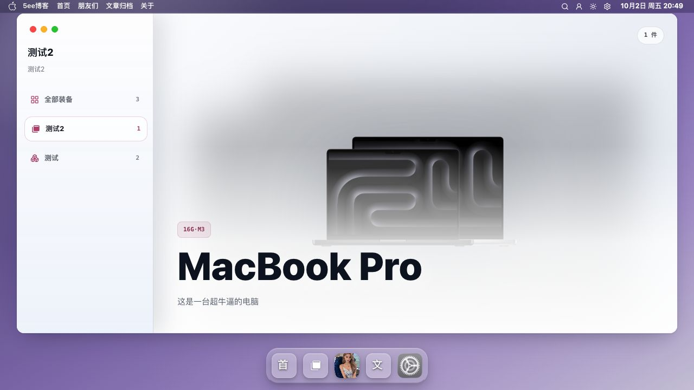

# 装备截图

装备应用用于按分组浏览设备，集中展示封面、规格和介绍。

[返回 README](../../../README.md) · [使用指南](../装备.md) · [全部功能](../../功能展示.md)

截图采集于 **2026-10-02**，主题为 **v0.9.47**；仅记录前台展示，插件内容写入、完整分页与真机验收以使用指南为准。

## 截图目录

- [截图 1：装备列表](#截图-1)
- [截图 2：单个装备分组](#截图-2)

## 截图 1

**装备列表**

侧栏列出装备分组，内容区展示设备图片及相关信息。

## 截图 2

**单个装备分组**

选中分组后，内容区展示该组的一件 MacBook 设备及相关信息。

