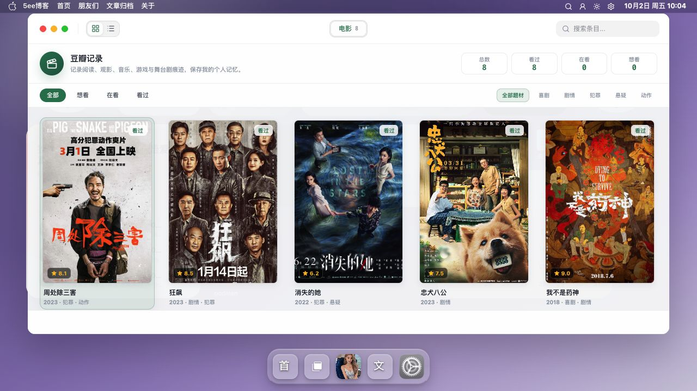
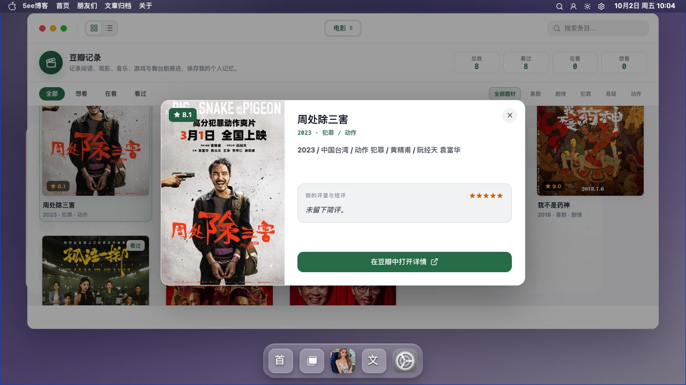

# 豆瓣截图

豆瓣应用用于浏览个人书影音收藏，并通过 Quick Look 查看已加载条目的信息。

[返回 README](../../../README.md) · [使用指南](../豆瓣.md) · [全部功能](../../功能展示.md)

截图采集于 **2026-10-02**，主题为 **v0.9.47**；仅记录前台展示，插件同步与写入验收以使用指南为准。

## 截图目录

- [截图 1：书影音列表](#截图-1)
- [截图 2：Quick Look 预览](#截图-2)

## 截图 1

**书影音列表**

电影收藏以海报列表展示，侧栏和工具栏提供类型、状态、题材及搜索入口。

## 截图 2

**Quick Look 预览**

打开已加载条目的预览，可查看封面、评分与收藏信息。

