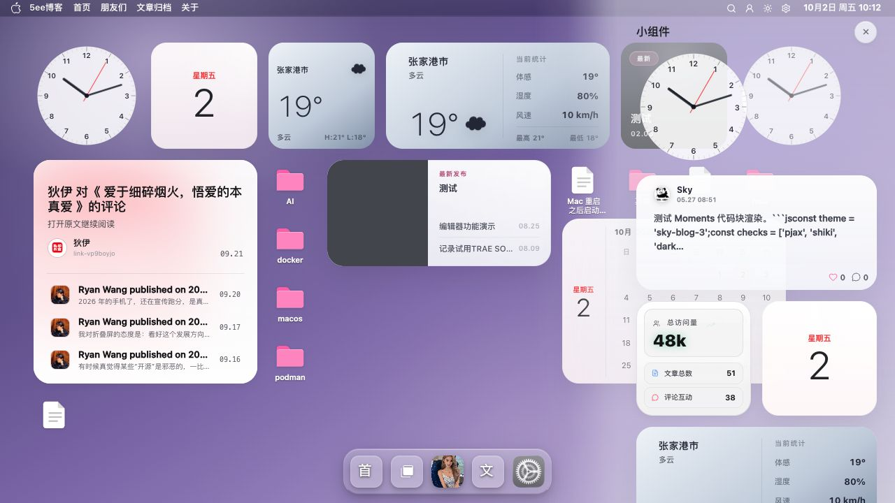

# 通知中心截图

通知中心在桌面提供集中查看公共组件的面板入口。

[返回 README](../../../README.md) · [使用指南](../桌面壳层.md) · [全部功能](../../功能展示.md)

截图采集于 **2026-10-02**，主题为 **v0.9.47**；仅记录桌面入口与公共组件展示，交互和布局保存验收以使用指南为准。

## 截图目录

- [截图 1：桌面入口](#截图-1)
- [截图 2：通知中心公共组件](#截图-2)

## 截图 1

**桌面入口**

桌面顶栏与内容区域提供通知中心所在的使用环境。

## 截图 2

**通知中心公共组件**

通知中心面板集中展示可公开浏览的组件内容。

