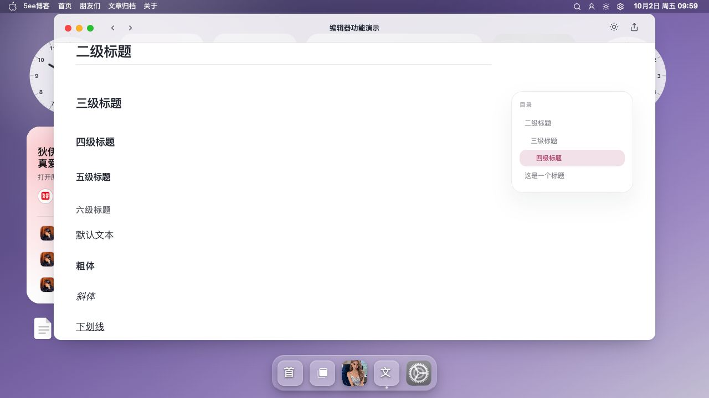
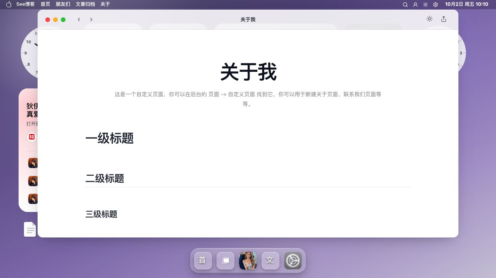

# 阅读页截图

阅读页承接文章与独立页面，提供正文、封面和页内目录等阅读界面。

[返回 README](../../../README.md) · [使用指南](../阅读页.md) · [全部功能](../../功能展示.md)

截图采集于 **2026-10-02**，主题为 **v0.9.47**；桌面图来自 **1280×720 或 1135×720 浏览器窗口**，手机图来自 **390×844 浏览器窄屏预览**。图集记录页面展示，交互与写入验收范围见使用指南；真机体验仍需独立验收。

[截图 1](#截图-1) · [截图 2](#截图-2) · [截图 3](#截图-3) · [截图 4](#截图-4)

## 截图 1

**文章首屏**：文章标题与封面。

## 截图 2

**正文与目录**：文章正文及页内目录的布局。

## 截图 3

**独立页面**：「关于我」独立页面的阅读界面。

## 截图 4

**手机文章阅读**：390×844 浏览器窄屏中的文章阅读预览。

