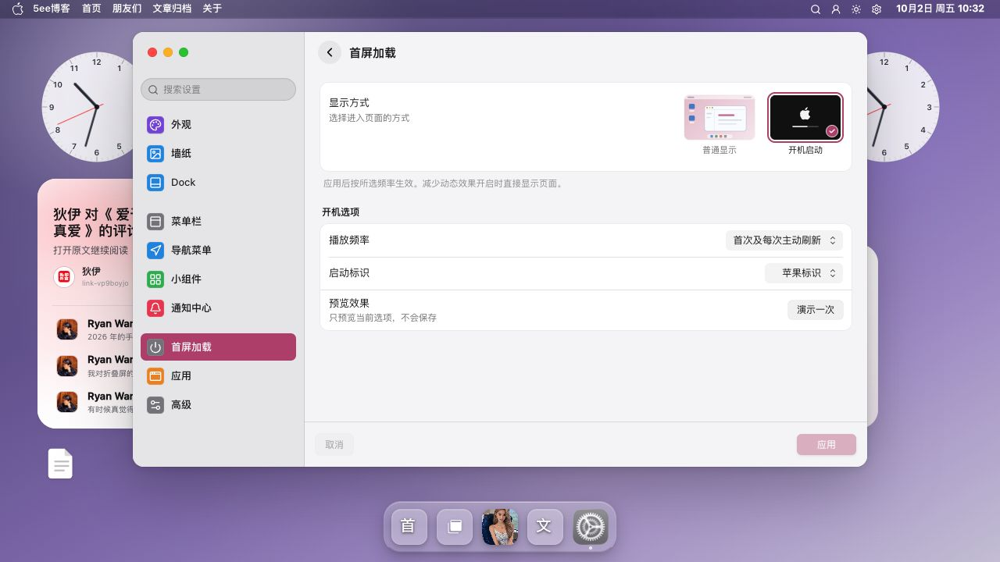
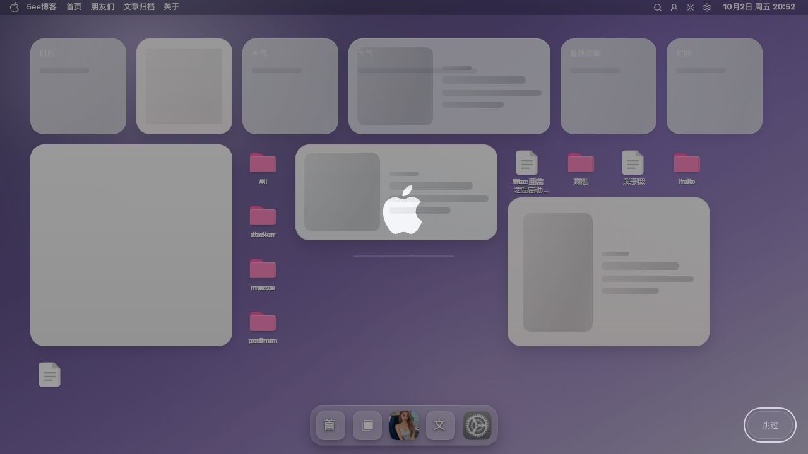

# 首屏加载截图

首屏加载设置用于选择首次访问时的显示方式，并配置开机演示选项。

[返回 README](../../../README.md) · [使用指南](../../设置/前端系统设置.md#首屏加载) · [全部功能](../../功能展示.md)

截图采集于 **2026-10-02**，主题为 **v0.9.47**；设置界面展示不代表配置已应用或持久化，具体行为以使用指南为准。

## 截图目录

- [截图 1：首屏加载设置](#截图-1)
- [截图 2：启动准备画面](#截图-2)

## 截图 1

**首屏加载设置**

系统设置展示首屏显示方式、播放频率和启动标识等选项。

## 截图 2

**启动准备画面**

实际重载的准备阶段显示 Apple 标识、进度条与页面骨架；画面记录加载过程，不代表加载完成。

