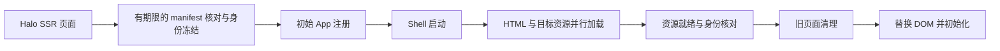

# 架构总览

## 结论

`theme-sky-blog-3` 现在已经不是 `feature` 拼装主题，而是 4 层结构：

1. `shell-core`
2. `apps`
3. `widgets`
4. `templates/assets`

核心原则只有 5 条：

1. 主题自有 App 页面走公共桌面壳层；插件自有前台页面可调用 Halo 页面布局契约
2. 页面协议和页面运行时归 `apps/*`
3. 小组件协议和渲染归 `widgets/*`
4. PJAX 只替换内容容器，不替换外壳
5. 构建产物只进入 [/templates/assets](/templates/assets)

## 当前目录分层

### 1. 协议层

- [/theme.yaml](/theme.yaml)
- [/settings.yaml](/settings.yaml)
- [/annotation-setting.yaml](/annotation-setting.yaml)

职责：

- 主题元数据
- 后台配置
- 注解配置

### 2. 路由入口层

- [/templates/index.html](/templates/index.html)
- [/templates/photos.html](/templates/photos.html)
- [/templates/moments.html](/templates/moments.html)
- [/templates/moment.html](/templates/moment.html)
- [/templates/links.html](/templates/links.html)
- [/templates/bangumis.html](/templates/bangumis.html)
- [/templates/douban.html](/templates/douban.html)
- [/templates/docs.html](/templates/docs.html)
- [/templates/doc.html](/templates/doc.html)
- [/templates/doc-catalog.html](/templates/doc-catalog.html)
- [/templates/steam.html](/templates/steam.html)
- [/templates/equipments.html](/templates/equipments.html)
- [/templates/layout.html](/templates/layout.html)
- [/templates/gateway_fragments/layout.html](/templates/gateway_fragments/layout.html)
- [/templates/modules/browser-reader](/templates/modules/browser-reader)
- [/templates/modules/browser-explorer](/templates/modules/browser-explorer)
- [/templates/modules/photos-app](/templates/modules/photos-app)
- [/templates/modules/moments-app](/templates/modules/moments-app)
- [/templates/modules/links-app](/templates/modules/links-app)
- [/templates/modules/bangumis-app](/templates/modules/bangumis-app)
- [/templates/modules/douban-app](/templates/modules/douban-app)
- [/templates/modules/docsme-app](/templates/modules/docsme-app)
- [/templates/modules/steam-app](/templates/modules/steam-app)
- [/templates/modules/equipments-app](/templates/modules/equipments-app)

职责：

- 作为 Halo 路由入口保留
- 输出 `pageApp / pageMode / windowVariant`
- 输出 `data-app-root / data-app-props`
- 把 SSR 内容塞进壳层规定的内容容器

上述页面协议约束主题自有 App 页面。`templates/layout.html` 是 Halo 2.26+ 插件自有前台页面可调用的 `html(head, content)` 布局契约，提供主题外观与 `<halo:footer />`；它不要求插件页面进入 `src/apps/*`，也不替代桌面壳层。`Theme.status.pageLayout=SUPPORTED` 只确认静态签名，真实插件页面还须单独验证。

### 3. 壳层层

- [/src/shell-core](/src/shell-core)
- [/src/shell/desktop-shell](/src/shell/desktop-shell)
- [/templates/modules/shell](/templates/modules/shell)

职责：

- route manifest
- app manifest
- resource registry
- app loader
- PJAX
- window frame / titlebar primitives
- 桌面层、Dock、Header、主窗口

### 4. 页面 app 层

- [/src/apps/reader](/src/apps/reader)
- [/src/apps/moments](/src/apps/moments)
- [/src/apps/photos](/src/apps/photos)
- [/src/apps/links](/src/apps/links)
- [/src/apps/bangumis](/src/apps/bangumis)
- [/src/apps/douban](/src/apps/douban)
- [/src/apps/docsme](/src/apps/docsme)
- [/src/apps/steam](/src/apps/steam)
- [/src/apps/equipments](/src/apps/equipments)
- [/src/apps/auth](/src/apps/auth)
- [/src/apps/explorer/tags](/src/apps/explorer/tags)
- [/src/apps/explorer/categories](/src/apps/explorer/categories)
- [/src/apps/explorer/author](/src/apps/explorer/author)
- [/src/apps/explorer/archives](/src/apps/explorer/archives)

职责：

- `entry`
- `manifest`
- `protocol`
- `state`
- `hydrate / dispose / documentState`
- 页面私有 `runtime`
- 页面私有 `styles`

### 5. widget 层

- [/src/widgets](/src/widgets)

职责：

- manifest registry
- 按 widget type 懒加载 render
- widget shared helpers
- 桌面组件中心 catalog 来源

### 6. 共享层

- [/src/shared](/src/shared)

职责：

- app props 读取
- Alpine destroy helper
- 通用工具

## 页面模型

| 页面 | `appId` | `pageMode` | `windowVariant` | 目录 |
| --- | --- | --- | --- | --- |
| 首页桌面 | `''` | `browser-home` | `none` | [/templates/index.html](/templates/index.html) |
| 阅读页 | `reader` | `browser-reader` | `browser` | [/src/apps/reader](/src/apps/reader) |
| 瞬间 | `moments` | `browser-moments` | `moments` | [/src/apps/moments](/src/apps/moments) |
| 友链 / RSS 朋友圈 | `links` | `browser-links` | `links` | [/src/apps/links](/src/apps/links) |
| 追番 | `bangumis` | `browser-bangumis` | `bangumis` | [/src/apps/bangumis](/src/apps/bangumis) |
| 豆瓣 | `douban` | `browser-douban` | `douban` | [/src/apps/douban](/src/apps/douban) |
| Docsme | `docsme` | `browser-docsme` | `docsme` | [/src/apps/docsme](/src/apps/docsme) |
| Steam | `steam` | `browser-steam` | `steam` | [/src/apps/steam](/src/apps/steam) |
| 装备 | `equipments` | `browser-equipments` | `equipments` | [/src/apps/equipments](/src/apps/equipments) |
| 图库 | `photos` | `browser-list` | `photos` | [/src/apps/photos](/src/apps/photos) |
| 标签 | `explorer-tags` | `browser-list` | `browser` | [/src/apps/explorer/tags](/src/apps/explorer/tags) |
| 分类 | `explorer-categories` | `browser-list` | `browser` | [/src/apps/explorer/categories](/src/apps/explorer/categories) |
| 作者 | `explorer-author` | `browser-list` | `browser` | [/src/apps/explorer/author](/src/apps/explorer/author) |
| 归档 | `explorer-archives` | `browser-list` | `browser` | [/src/apps/explorer/archives](/src/apps/explorer/archives) |
| 认证页 | `auth` | `auth` | `none` | [/src/apps/auth](/src/apps/auth) |

插件页面适配的完整状态看 [/docs/插件适配状态.md](/docs/插件适配状态.md)。

## 壳层 contract

### 1. 页面协议字段

`body` 级：

- `data-app-id`
- `data-page-app`
- `data-page-mode`
- `data-window-variant`
- `data-window-metrics-key`

页面 root 级：

- `data-app-root="appId"`
- `<script type="application/json" data-app-props="appId">`

### 2. 标题栏协议

公共片段：

- [/templates/modules/shell/window-titlebar.html](/templates/modules/shell/window-titlebar.html)
- [/templates/modules/shell/window-titlebar-leading.html](/templates/modules/shell/window-titlebar-leading.html)
- [/templates/modules/shell/window-titlebar-actions.html](/templates/modules/shell/window-titlebar-actions.html)

公共字段：

- `data-window-title`
- `data-window-subtitle`

### 3. 内容区协议

公共片段：

- [/templates/modules/shell/window-frame.html](/templates/modules/shell/window-frame.html)

公共字段：

- `data-window-content-root`
- `data-window-content-variant`
- `data-window-loading-overlay`

## 运行时 contract

### App lifecycle

注册入口：

- [/src/shell/desktop-shell/runtime/shared/page-app.js](/src/shell/desktop-shell/runtime/shared/page-app.js)

每个 app 允许实现：

- `resolveProtocol(root)`
- `hydrate(root, context)`
- `dispose(root, context)`
- `getDocumentState(root, context)`

### Widget lifecycle

注册入口：

- [/src/widgets/registry.js](/src/widgets/registry.js)
- [/src/widgets/loaders.js](/src/widgets/loaders.js)

每个 widget 至少包含：

- `manifest`
- `renderWidget(...)`

## 构建规则

构建入口：

- [/vite.config.ts](/vite.config.ts)

多入口产物：

- `shell-core`
- `auth`
- `reader`
- `moments`
- `links`
- `bangumis`
- `douban`
- `docsme`
- `photos`
- `steam`
- `equipments`
- `explorer-tags`
- `explorer-categories`
- `explorer-author`
- `explorer-archives`

资产索引：

- [/templates/assets/asset-manifest.json](/templates/assets/asset-manifest.json)

当前落盘结构：

- `assets/js/shell-core/index.js`
- `assets/js/apps/auth/index.js`
- `assets/js/apps/reader/index.js`
- `assets/js/apps/moments/index.js`
- `assets/js/apps/links/index.js`
- `assets/js/apps/bangumis/index.js`
- `assets/js/apps/douban/index.js`
- `assets/js/apps/docsme/index.js`
- `assets/js/apps/photos/index.js`
- `assets/js/apps/steam/index.js`
- `assets/js/apps/equipments/index.js`
- `assets/js/apps/tags/index.js`
- `assets/js/apps/categories/index.js`
- `assets/js/apps/author/index.js`
- `assets/js/apps/archives/index.js`
- `assets/js/chunks/apps/*`
- `assets/js/chunks/shared/*`
- `assets/js/chunks/shell-core/*`
- `assets/js/chunks/widgets/*`

## 当前硬规则

1. 页面运行时代码不得再回流到 `src/features/*`
2. `route-manifest` 是路由归类单一来源
3. `app-manifests` 是 same-variant 行为单一来源
4. 模板不得再内联 URL 正则判断 app
5. 构建后旧产物必须被清理
6. 新增主题自有 App 页面必须进入 `src/apps/*`；插件自有页面遵守 `templates/layout.html` 契约

## 资源与生命周期执行规则（2026-09-27）

- `src/apps/*/manifest.js` 的 `entry` 和 `assetDirectory` 是源码入口与生成资源目录的来源；Vite、App loader、CSS router 共用 `app-manifests.js` 的映射。SSR 的少量 Thymeleaf 别名由契约门禁逐项核对。
- 首次启动在有期限的 manifest 请求后冻结 `version + revision`，先导入初始 App 注册器，再启动 Shell。网络失败走同一身份的 SSR 回退；迟到响应不能改变已经启动的资源身份。
- PJAX 并行请求 HTML 与目标 App CSS/JS，在替换 DOM 前等待资源就绪。发现构建漂移时走完整导航，避免新旧资源混用。
- 页面初始化失败后仍清理已分配资源；多个清理步骤分别执行，单个异常不会阻断后续释放。
- 归档目录优先使用官方标签筛选和 `total`，密集归档减少完整文章列表传输；跨度稀疏时按页增量聚合。缓存按 URL 与 SSR 登录主体隔离，5 分钟过期；不完整结果不缓存。

`lint` 解析 JavaScript 语法、静态导入、分层与循环依赖；`typecheck` 是保留名称的 App 协议/资源契约校验，不是全量 JavaScript 表达式类型检查。构建后再检查实际静态依赖图及资源预算。
