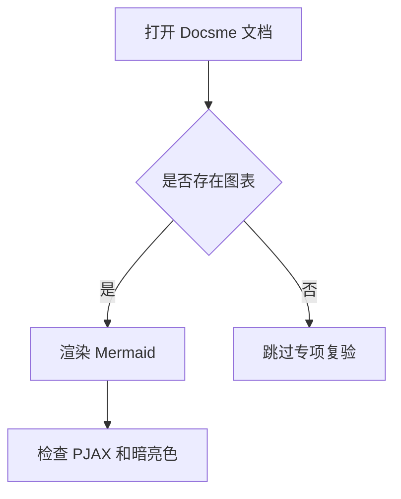

# 测试样本数据

## 结论

这份文档只保存用于主题复验的最小样本内容。样本用于验证 Shiki、KaTeX、Mermaid、评论、PJAX 和暗亮色切换，不作为正式站点内容建议。

当前不通过脚本直接创建后台数据，原因是 Moments 和 Docsme 公开资料只明确了查询/主题消费契约，没有稳定的创建 API 契约。样本建议在 Halo 后台或对应插件后台手动创建。

## Moments 代码块样本

用途：

| 验证项 | 目标 |
| --- | --- |
| Shiki | 瞬间详情页代码块能渲染 |
| PJAX | 从 `/moments` 进入详情后不重复渲染、不丢失 |
| 评论 | 与已有评论样本共同覆盖评论壳层 |

建议内容：

````markdown
测试 Moments 代码块渲染。

```js
const theme = 'sky-blog-3';
const checks = ['pjax', 'shiki', 'dark-mode'];

console.log(`${theme}: ${checks.join(', ')}`);
```
````

创建后复验：

```bash
pnpm run verify:moments
```

如果脚本没有自动发现样本，指定详情路径：

```bash
MOMENTS_CODE_SAMPLE_PATH=/moments/<moment-name> pnpm run verify:moments
```

## Docsme KaTeX 样本

用途：

| 验证项 | 目标 |
| --- | --- |
| KaTeX | 文档正文能渲染数学公式 |
| Docsme | 文档模板、目录、评论和 SEO 协议不破 |
| PJAX | 文档内跳转后公式不丢失 |

建议内容：

```markdown
# Docsme KaTeX 样本

行内公式：$E = mc^2$

块级公式：

$$
\\int_0^1 x^2 dx = \\frac{1}{3}
$$
```

创建后复验：

```bash
pnpm run verify:docsme
```

如果脚本没有自动发现样本，指定详情路径：

```bash
DOCSME_KATEX_SAMPLE_PATH=/docs/<project>/<doc> pnpm run verify:docsme
```

## Docsme Mermaid 样本

用途：

| 验证项 | 目标 |
| --- | --- |
| Mermaid | 文档正文能渲染流程图 |
| 暗亮色 | 切换主题后图表不破版 |
| PJAX | 文档内往返后图表不重复 |

建议内容：

````markdown
# Docsme Mermaid 样本


````

创建后复验：

```bash
pnpm run verify:docsme
```

如果脚本没有自动发现样本，指定详情路径：

```bash
DOCSME_MERMAID_SAMPLE_PATH=/docs/<project>/<doc> pnpm run verify:docsme
```

## 当前缺口

| 样本 | 当前状态 | 收口方式 |
| --- | --- | --- |
| Moments 代码块 | 缺少真实内容 | 后台创建后运行 `pnpm run verify:moments` |
| Docsme KaTeX | 缺少真实内容 | 后台创建后运行 `pnpm run verify:docsme` |
| Docsme Mermaid | 缺少真实内容 | 后台创建后运行 `pnpm run verify:docsme` |
